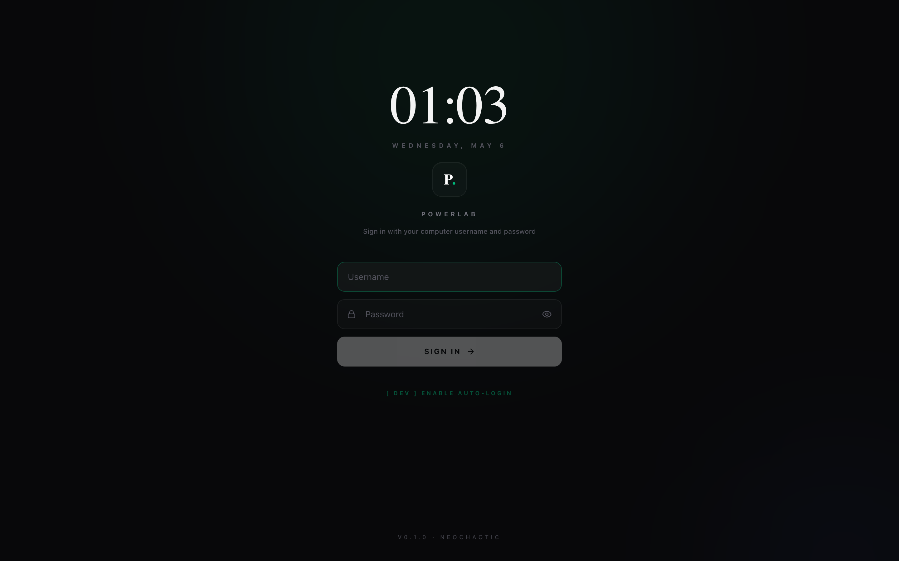
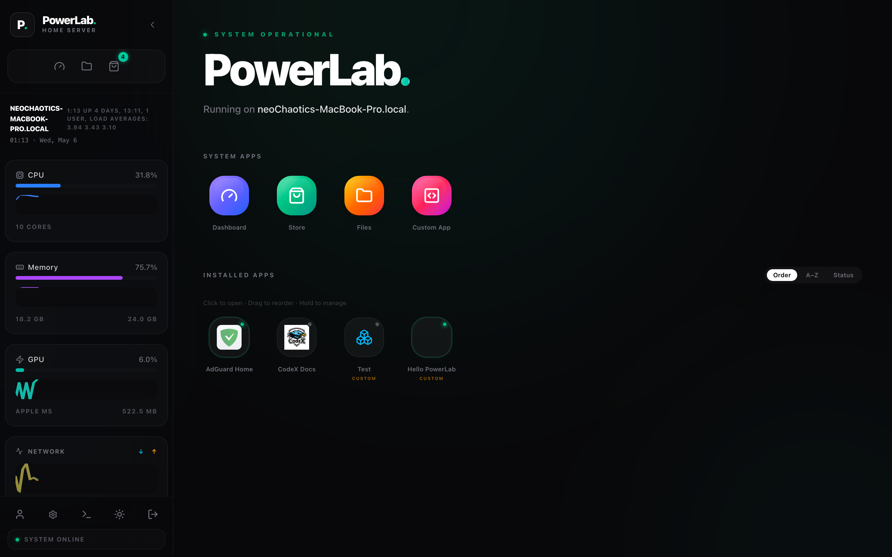
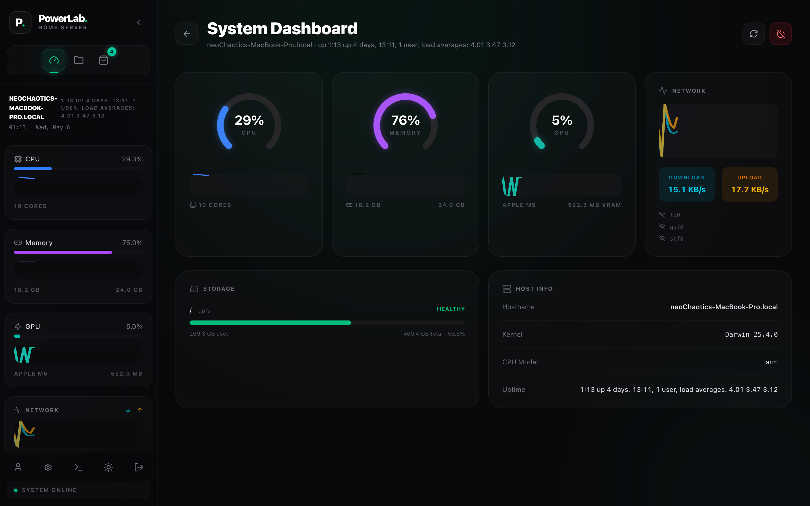
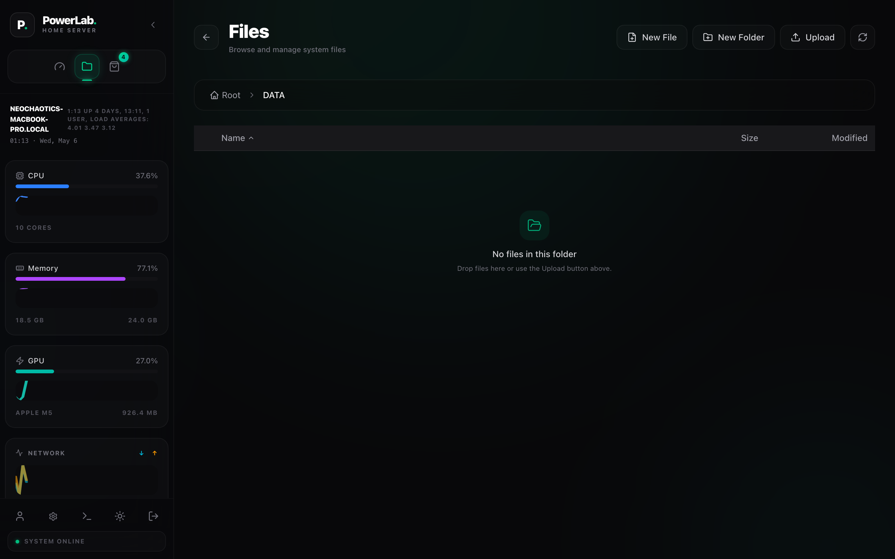
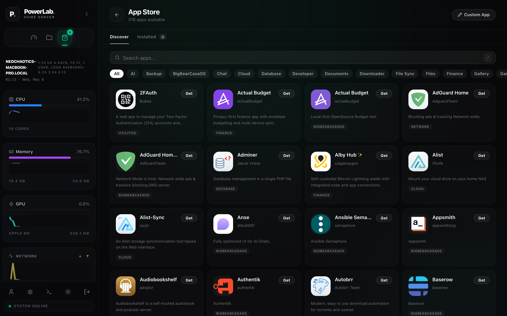
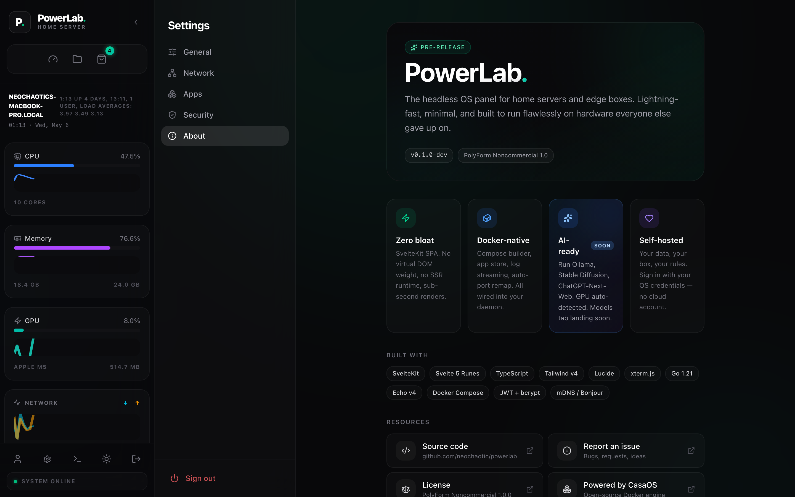

<div align="center">

<br>



<br>
<br>

# PowerLab

### One pane of glass for everything you self-host.

Your apps. Your files. Your AI. Your home server, finally beautiful.

<br>

### ⚡  Get started in 60 seconds

**Linux** (Pi 4/5, Intel mini-PC, any amd64/arm64 server) — production install:

```bash
curl -fsSL https://raw.githubusercontent.com/neochaotic/powerlab/main/install.sh | sudo bash
```

**macOS** (Apple Silicon) — dev / demo mode:

```bash
curl -fsSL https://raw.githubusercontent.com/neochaotic/powerlab/main/install-mac.sh | bash
```

**Then open the URL the installer prints from any device on the network.**

<sub>Idempotent — re-run any time to upgrade. Source build → see <a href="#install">Install</a> & <a href="#develop">Develop</a> below.</sub>

<br>

[](LICENSE)
[](#built-for-ai)
[](https://kit.svelte.dev)
[](https://go.dev)
[](https://github.com/neochaotic/powerlab/actions)
[]()

<br>

[Install](#install) · [Tour](#a-tour) · [App Store](#three-hundred-apps-one-click) · [AI](#built-for-ai) · [Compatibility](#compatibility) · [Architecture](#architecture) · [Develop](#develop)

</div>

<br>

---

## A new home for your home server.

Open a browser. Type `powerlab.local`. There it is — every container, every gigabyte, every blinking GPU, on one screen designed to feel like the rest of your devices.

Built on a battle-tested Go core. Wrapped in a SvelteKit interface tuned to the millisecond. PowerLab brings the polish of a finished product to the corner of the room you used to apologise for.

<br>

## Designed for the way you live with your hardware.

- **Open formats from end to end.** Apps are plain Docker Compose. Your data lives in a folder you can `cd` into. Nothing is proprietary, nothing is locked away.
- **Sign in with the password you already know.** PowerLab uses your operating-system credentials. One identity, one less thing to forget.
- **Quiet by default.** Dark theme, considered typography, animations that respect attention. The panel does its job and gets out of the way.
- **Reachable everywhere on your LAN.** mDNS announces the box at `powerlab.local` automatically — wifi, ethernet, any device, no IP juggling.

<br>

---

## A tour

<table>
<tr>
<td width="50%">
<br>
<sub><b>Lock screen.</b> Sign in with your computer username and password. The clock greets you. There's nothing else.</sub>
</td>
<td width="50%">
<br>
<sub><b>Launchpad.</b> Every native tool and every installed app, on one screen. Drag to reorder. Long-press for the per-tile menu.</sub>
</td>
</tr>
<tr>
<td width="50%">
<br>
<sub><b>Dashboard.</b> Radial gauges for CPU, RAM, GPU. Dual sparklines for network. Disk-by-disk usage. Updated every second, smoothed so it never flickers.</sub>
</td>
<td width="50%">
<br>
<sub><b>Files.</b> Virtualised for ten thousand entries. Side-panel preview that plays video, audio, PDFs. Drop a folder anywhere on the page to upload. CodeMirror opens text files in place.</sub>
</td>
</tr>
<tr>
<td width="50%">
<br>
<sub><b>App Store.</b> Three hundred curated apps. One click to install. Live install logs. Auto-port remap. Fork any app into your own with a tap.</sub>
</td>
<td width="50%">
<br>
<sub><b>About.</b> Version, license, the stack we built on, links to source. Settings is for settings.</sub>
</td>
</tr>
</table>


<br>

---

## Three hundred apps. One click.

A curated catalogue of **300+ ready-to-install Docker apps**, organised by category, filtered by what your hardware can run, installable in a single tap.

<br>

| Category | A glimpse |
|---|---|
| **Media** | Plex · Jellyfin · Emby · Navidrome · Audiobookshelf · Calibre-web · Bazarr |
| **Files & Sync** | Nextcloud · Syncthing · Filebrowser · Duplicati · AList · CopyParty |
| **Network & VPN** | AdGuard Home · Pi-hole · WireGuard · Tailscale · Cloudflared · DDNS-Updater |
| **Productivity** | Vikunja · Wallabag · Bookstack · Memos · Beaver Habit Tracker |
| **AI & ML** | Ollama · ChatGPT-Next-Web · AnythingLLM · ChatbotUI · Open WebUI |
| **Database** | Adminer · CloudBeaver · Memcached · Redis · Postgres |
| **Finance** | Actual Budget · 2FAuth · Vaultwarden |
| **Developer** | Gitea · Forgejo · Drone · Verdaccio · Code-Server |
| **Smart home** | Home Assistant · Frigate · Node-RED · Mosquitto |

Behind every install: PowerLab quietly handles port collisions, streams the install logs in real time, surfaces compatibility warnings before the pull starts, and remembers everything in a clean local YAML you can read.

<br>

---

## Build your own. Right inside the panel.

Not in the catalogue? Build it.

The **Custom App Builder** is a visual editor for Docker Compose, with the YAML always open beside it. Touch a field, the YAML updates. Edit the YAML, the form follows. Pick the side you prefer.

- **Smart fields.** Memory limits as sliders. Port mappings validated against the host *before* you deploy. Volume mounts that recognise privileged-folder requirements.
- **Pre-flight check.** Every port you publish gets probed. If something is busy, PowerLab suggests an alternative — and hands you the keyboard so you can choose.
- **Fork in one click.** Any store app can be forked into a Custom App. Tweak the image tag. Swap a volume path. Add an environment variable. The original stays pristine.
- **Yours, in plain YAML.** Custom apps live as `docker-compose.yml` files under `$AppsPath/<name>/`. Version them in git. Share them. Move them. There is no proprietary format to escape.

The full power of Compose. None of the friction.

<br>

---

## Built for AI.

PowerLab was designed with local AI in mind. The same Compose-native runtime that hosts your media library happily hosts **Ollama, Stable Diffusion WebUI, ChatGPT-Next-Web, AnythingLLM, ChatbotUI, Open WebUI, Whisper.cpp, ComfyUI** — every popular self-hosted AI tool ships as a Docker image and PowerLab knows how to install it.

What makes the AI experience effortless:

- **GPU detection, automatic.** Apple Silicon (M-series via `ioreg`) and Nvidia (via `nvidia-smi`) appear on the Dashboard the moment you open it. No drivers to chase, no config files to edit.
- **Memory and VRAM, live.** Telemetry refreshes every second. Watch a 7B model load in real time, see how much VRAM your prompt is using, know when to scale down.
- **The catalogue knows AI.** Search the App Store for "Ollama", "AnythingLLM", "ChatGPT-Next-Web" — install in one click, ports remapped, logs streaming.
- **Designed for the lab on your shelf.** Quiet GPU rigs, Apple Silicon Macs, Nvidia Jetson, Intel mini PCs. PowerLab feels at home on the hardware you already trust.

> **Coming soon: a first-class Models tab.** Drag-and-drop GGUF imports. One-click Ollama pulls. Side-by-side benchmarks. Quantization presets. The future of local AI, with the polish of a real product.

<br>

---

## Install

<details>
<summary><b>One-liner installer (recommended)</b></summary>

<br>

```bash
curl -fsSL https://raw.githubusercontent.com/neochaotic/powerlab/main/install.sh | sudo bash
```

Auto-detects amd64 / arm64, downloads the matching tarball, runs the bundled installer, cleans up. Re-run any time to upgrade.

Pin a specific version:

```bash
curl -fsSL https://raw.githubusercontent.com/neochaotic/powerlab/main/install.sh | sudo bash -s -- --version v0.1.5
```

</details>

<details>
<summary><b>Inspect-first, then run (no <code>curl | bash</code>)</b></summary>

<br>

```bash
curl -fsSL https://raw.githubusercontent.com/neochaotic/powerlab/main/install.sh -o install.sh
less install.sh                        # read what it does
sudo bash install.sh                   # then run
```

</details>

<details>
<summary><b>Manual tarball install</b></summary>

<br>

If you would rather download and extract by hand. Replace `ARCH` with `amd64` or `arm64`:

```bash
curl -fL -o /tmp/powerlab.tar.gz \
  https://github.com/neochaotic/powerlab/releases/latest/download/powerlab-linux-ARCH.tar.gz
mkdir -p /tmp/powerlab-install
tar -xzf /tmp/powerlab.tar.gz --strip-components=1 -C /tmp/powerlab-install
sudo /tmp/powerlab-install/install.sh
```

The installer creates `/etc/powerlab`, `/var/lib/powerlab`, `/var/log/powerlab`, `/var/run/powerlab`, and `/DATA/AppData`, then registers and starts six systemd services. The end-of-install banner prints the URL to open in your browser.

</details>

<details>
<summary><b>macOS dev mode (Apple Silicon)</b></summary>

<br>

PowerLab is a Linux-first product — production deployments target Pi / mini-PC / arm64 boxes. On macOS we ship a **dev-mode bootstrap** that clones the repo into `~/Documents/powerlab` and runs the same SvelteKit + Go stack locally:

```bash
curl -fsSL https://raw.githubusercontent.com/neochaotic/powerlab/main/install-mac.sh | bash
```

Use this for development, demos, or kicking the tires. Caveats:

- The Files page is disabled (the `local-storage` service depends on Linux fuse + xattr).
- Nothing auto-starts at boot — you keep the terminal open while `dev.sh` runs.
- Auth uses `dscl . -authonly` against your Mac's Directory Service, so you sign in with your computer username + password directly (no Setup Wizard).

Requires Homebrew, `git`, `go`, `node`, and Docker Desktop.

For real production, install on Linux instead.

</details>

<details>
<summary><b>Build from source</b></summary>

<br>

Requires **Go 1.21+**, **Node.js 20+**, **Docker Engine**.

```bash
git clone https://github.com/neochaotic/powerlab.git
cd powerlab
./scripts/package-linux.sh amd64        # or: arm64
sudo ./dist/powerlab-*-linux-amd64/install.sh
```

</details>

<br>

---

## Develop

One command, the whole stack:

```bash
git clone https://github.com/neochaotic/powerlab.git
cd powerlab
./dev.sh
```

`dev.sh` checks your prerequisites, installs UI dependencies on first run, builds and starts every backend service, then launches the Vite dev server. Stop everything with **Ctrl-C** and it tears the stack down cleanly. Pass `--no-build` to skip the backend rebuild for faster restarts, or `--stop` to shut everything down.

The dev gateway listens on port 80; the UI dev server runs at `localhost:5173` and proxies API calls to it. The Files page is unavailable in macOS dev mode (`local-storage` requires Linux fuse + xattr — that service is skipped automatically).

<details>
<summary><b>Tests</b></summary>

<br>

```bash
# Frontend
cd ui
npx svelte-check        # type check
npx vitest run          # unit tests
npm run build           # production build

# Backend (each service has its own go.mod)
cd backend/<service>
go generate ./...       # produces codegen/ from OpenAPI spec
go test -race ./...
```

CI runs all of the above on every push to `main` (`.github/workflows/ci.yml`).

</details>

<br>

---

## Architecture

```
┌────────────────────────────────────────────────────────────┐
│  Browser (any device on the LAN)                           │
│  ┌──────────────────────────────────────────────────────┐  │
│  │  SvelteKit SPA (adapter-static, no SSR)              │  │
│  │  Svelte 5 Runes · Tailwind v4 · Lucide · CodeMirror  │  │
│  └────────────────────────┬─────────────────────────────┘  │
└───────────────────────────┼────────────────────────────────┘
                            │  HTTPS / WSS
                            ▼
┌────────────────────────────────────────────────────────────┐
│  Gateway   :80 / :443                                       │
│  · JWT auth · static UI · WebSocket bridge                  │
│  · mDNS announcer (powerlab.local)                          │
└──┬──────────┬──────────┬──────────┬──────────┬──────────┬──┘
   ▼          ▼          ▼          ▼          ▼          ▼
 core    user-svc   message-bus  app-mgmt   local-store  cli
 sys     auth       SSE          Docker     filesystem   tools
 telemetry          fan-out      Compose
```

Six independent Go services, each with its own `go.mod` and codegen pipeline so they evolve independently. The gateway routes `/v1/*` and `/v2/*` to the right service based on a `routes.json` it rebuilds at every boot.

<br>

---

## Compatibility

| Platform | Status | Sign-in |
|---|---|---|
| **Ubuntu** 20.04 / 22.04 / 24.04 LTS · `amd64` `arm64` | ✅ Supported | Setup Wizard |
| **Debian** 11 / 12 · `amd64` `arm64`                   | ✅ Supported | Setup Wizard |
| **Raspberry Pi OS** Bookworm / Bullseye · `arm64`      | ✅ Supported | Setup Wizard |
| **Fedora** 38+ · **Arch** · **openSUSE** · `amd64`      | ⚠️ Untested, expected to work | Setup Wizard |
| **Alpine** · `amd64` `arm64`                            | ❌ Out of scope (musl + OpenRC) | — |
| **macOS** Sonoma+ · `arm64`                             | ✅ Dev mode (`./dev.sh`) | OS credentials |
| **Windows**                                            | ❌ Not planned | — |

The first time you open PowerLab, a one-shot **Setup Wizard** asks you to pick a username and password — that becomes your sign-in. On macOS dev, you sign in with your computer credentials directly via Directory Services. Native Linux PAM (so the Setup Wizard becomes optional and you can use your `useradd` password) is on the v0.2 roadmap.

JWTs are signed with the gateway's ECDSA key, rotated on first boot. Tokens last about three hours; the session cookie persists across reloads.

See **[SUPPORT.md](./SUPPORT.md)** for the deep matrix — hardware tiers, distro testing methodology, the rationale for deferring PAM, and how to report new compatibility results.

<br>

---

## License

**[GNU Affero General Public License v3.0](LICENSE).** Free and open-source software. You can use, modify, and redistribute PowerLab — including for commercial purposes — provided that any modified version you distribute (or host as a network service) is also released under the AGPL-3.0. See the [LICENSE](LICENSE) file for the full text.

<br>

---

<div align="center">

<sub>Crafted by <a href="https://github.com/neochaotic">neochaotic</a> · <a href="https://github.com/neochaotic/powerlab/issues">Report an issue</a> · <a href="https://github.com/neochaotic/powerlab/discussions">Discussions</a></sub>

</div>
