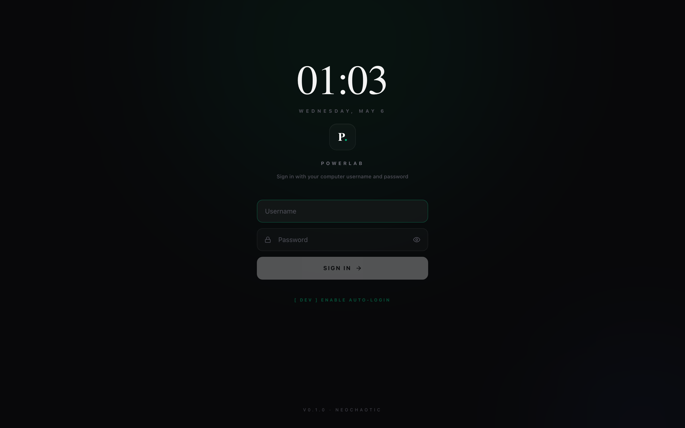
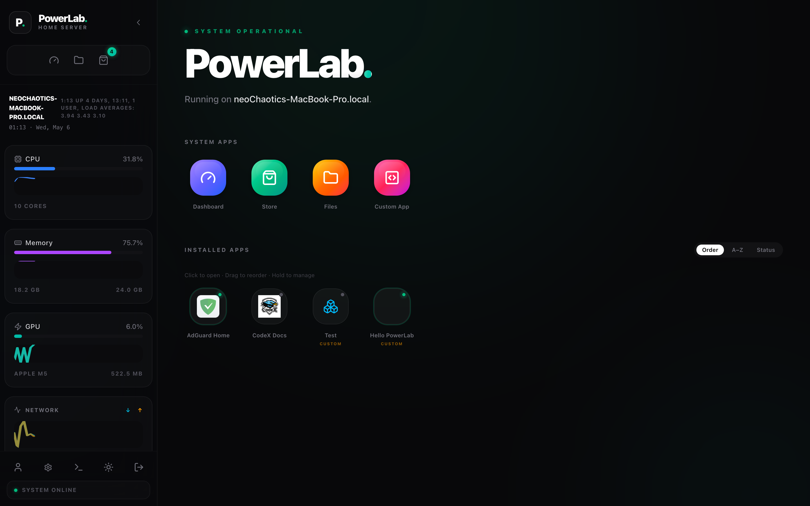
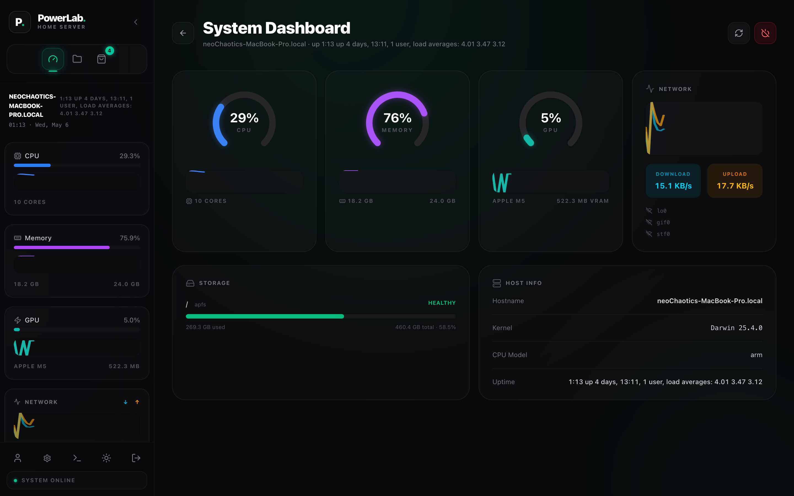
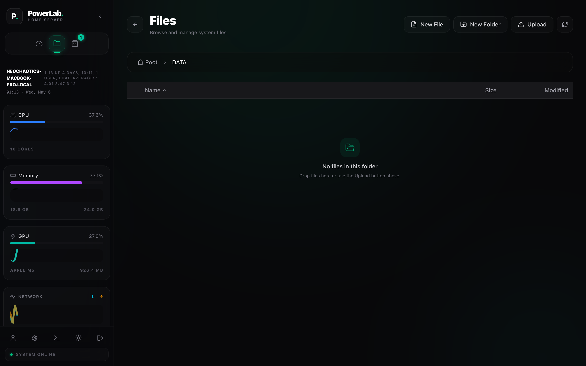
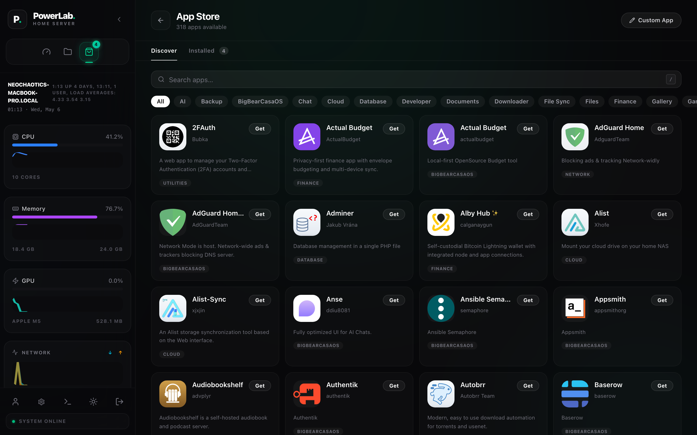
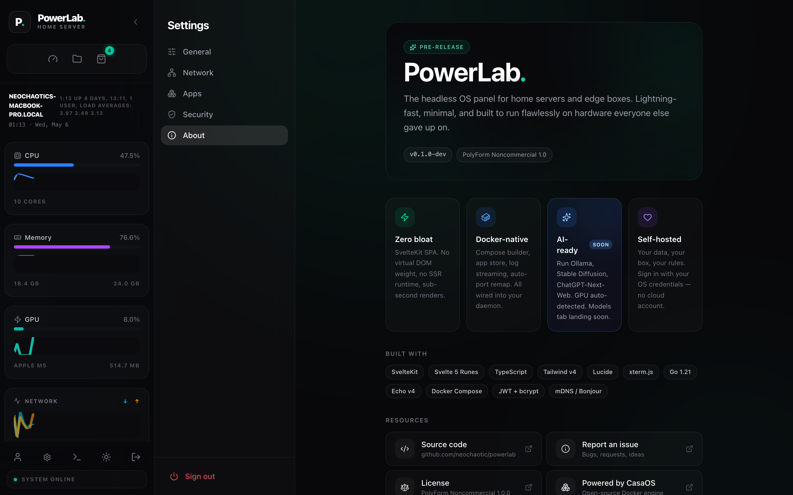

<div align="center">

<br>



<br>
<br>

# PowerLab

### One pane of glass for everything you self-host.

Your apps. Your files. Your AI. Your home server, finally beautiful.

<br>

### ⚡  Get started in 60 seconds

**Linux** (Pi 4/5, Intel mini-PC, any amd64/arm64 server) — beta install:

```bash
curl -fsSL https://raw.githubusercontent.com/neochaotic/powerlab/main/install.sh | sudo bash
```

**macOS** (Apple Silicon) — dev / demo mode:

```bash
curl -fsSL https://raw.githubusercontent.com/neochaotic/powerlab/main/install-mac.sh | bash
```

**Then open the URL the installer prints from any device on the network.**

<sub>Idempotent — re-run any time to upgrade. Source build → see <a href="#install">Install</a> & <a href="#develop">Develop</a> below.</sub>

<sub><b>PowerLab is in beta.</b> It is built for someone running a Raspberry Pi or mini-PC who is comfortable with Docker; breaking changes may land between minor versions until 1.0.</sub>

<br>

[](LICENSE)
[](#built-for-ai)
[](https://kit.svelte.dev)
[](https://go.dev)
[](https://github.com/neochaotic/powerlab/actions)
[](#status)

<br>

[Install](#install) · [Tour](#a-tour) · [App Store](#137-apps-one-click) · [AI](#built-for-ai) · [Compatibility](#compatibility) · [Origins](#where-powerlab-comes-from) · [Architecture](#architecture) · [Develop](#develop)

</div>

<br>

---

## A new home for your home server.

Open a browser. Type `powerlab.local`. There it is — every container, every gigabyte, every blinking GPU, on one screen designed to feel like the rest of your devices.

Built on a Go core that started life as [CasaOS](#where-powerlab-comes-from). Wrapped in a SvelteKit interface tuned to the millisecond. PowerLab brings the polish of a finished product to the corner of the room you used to apologise for.

<br>

## Designed for the way you live with your hardware.

- **Open formats from end to end.** Apps are plain Docker Compose. Your data lives in a folder you can `cd` into. Nothing is proprietary, nothing is locked away.
- **Sign in with the password you already know.** PowerLab uses your operating-system credentials. One identity, one less thing to forget.
- **Quiet by default.** Dark theme, considered typography, animations that respect attention. The panel does its job and gets out of the way.
- **Reachable everywhere on your LAN.** mDNS announces the box at `powerlab.local` automatically — wifi, ethernet, any device, no IP juggling.
- **Green padlock, no public DNS.** PowerLab provisions a private CA on first boot and signs its own leaf certificate covering `powerlab.local`, the host's LAN addresses, and `localhost`. One-tap trust install on iOS/macOS via a signed `.mobileconfig`; raw `.crt` for everyone else. HSTS only arms after the trust dance is verified end-to-end, so you can never be locked out of your own server. See the [HTTPS guide](docs/HTTPS.md). The built-in CA is slated for deprecation in favour of a reverse proxy in front of PowerLab — the [reverse-proxy recipes](docs/operations/reverse-proxy.md) are the forward path.

<br>

---

## A tour

<table>
<tr>
<td width="50%">
<br>
<sub><b>Lock screen.</b> Sign in with your computer username and password. The clock greets you. There's nothing else.</sub>
</td>
<td width="50%">
<br>
<sub><b>Launchpad.</b> Every native tool and every installed app, on one screen. Drag to reorder. Long-press for the per-tile menu.</sub>
</td>
</tr>
<tr>
<td width="50%">
<br>
<sub><b>Dashboard.</b> Radial gauges for CPU, RAM, GPU. Dual sparklines for network. Disk-by-disk usage. Updated every second, smoothed so it never flickers.</sub>
</td>
<td width="50%">
<br>
<sub><b>Files.</b> Virtualised for ten thousand entries. Side-panel preview that plays video, audio, PDFs. Drop a folder anywhere on the page to upload. CodeMirror opens text files in place.</sub>
</td>
</tr>
<tr>
<td width="50%">
<br>
<sub><b>App Store.</b> 137 curated apps. One click to install. Live install logs. Auto-port remap. Fork any app into your own with a tap.</sub>
</td>
<td width="50%">
<br>
<sub><b>About.</b> Version, license, the stack we built on, links to source. Settings is for settings.</sub>
</td>
</tr>
</table>


<br>

---

## 137 apps. One click.

Every release bundles a curated catalogue of **137 ready-to-install Docker apps**, organised by category and installable in a single tap. The catalogue is maintained in [neochaotic/powerlab-store](https://github.com/neochaotic/powerlab-store) and copied onto your box by the installer — PowerLab does not pull app definitions from anywhere at runtime.

Where the apps come from: 76 were adapted from the [Umbrel community catalog](https://github.com/getumbrel/umbrel-apps), 58 from the [CasaOS AppStore](https://github.com/IceWhaleTech/CasaOS-AppStore), and 3 were written for PowerLab. Every one was reworked to PowerLab's compose conventions and passes the store's security gate; upstream install hooks are never executed ([ADR-0039](docs/decisions/0039-powerlab-native-curated-catalog.md)). The store ships switched off; turn it on from the first-run prompt or Settings → Catalog. Need something that isn't listed? Build it yourself — see below.

<br>

| Category | A glimpse |
|---|---|
| **Media** | Jellyfin · Emby · Navidrome · Audiobookshelf · PhotoPrism · Calibre-web · Sonarr · Radarr · Bazarr |
| **Files & Sync** | Syncthing · Duplicati · CopyParty · Resilio Sync · Stirling-PDF · Papra |
| **Network & monitoring** | Uptime Kuma · Grafana · SmokePing · UniFi Controller · Web-Check |
| **Productivity** | Vikunja · Wallabag · Memos · Mealie · Linkwarden · AFFiNE · FreshRSS |
| **AI & ML** | Ollama (CPU · Nvidia · AMD builds) · Chatbot UI · Chatpad AI · Kokoro TTS · OpenCode |
| **Database & dev** | MariaDB · PostgreSQL · MongoDB · InfluxDB 2 · Adminer · Code-Server · JupyterLab · MinIO |
| **Passwords & finance** | Vaultwarden · Actual Budget · Monetr |

Behind every install: PowerLab quietly handles port collisions, streams the install logs in real time, surfaces compatibility warnings before the pull starts, and remembers everything in a clean local YAML you can read.

> **The catalog lives in its own repo: [neochaotic/powerlab-store](https://github.com/neochaotic/powerlab-store).**
> Independent product, independent release cadence; each PowerLab release bundles a tagged store snapshot. Every app passes a strict security gate (no `hooks/`, no `exports.sh`, no privileged mounts, digest-pinned images, rehosted icons) before merging. Want to **add an app** or **report a catalog bug**? Go there. Want to understand the **architecture decision** to split the catalog out? See [ADR-0041](docs/decisions/0041-powerlab-store-separate-repo.md).

<br>

---

## Build your own. Right inside the panel.

Not in the catalogue? Build it.

The **Custom App Builder** is a visual editor for Docker Compose, with the YAML always open beside it. Touch a field, the YAML updates. Edit the YAML, the form follows. Pick the side you prefer.

- **Smart fields.** Memory limits as sliders. Port mappings validated against the host *before* you deploy. Volume mounts that recognise privileged-folder requirements.
- **Pre-flight check.** Every port you publish gets probed. If something is busy, PowerLab suggests an alternative — and hands you the keyboard so you can choose.
- **Fork in one click.** Any store app can be forked into a Custom App. Tweak the image tag. Swap a volume path. Add an environment variable. The original stays pristine.
- **Yours, in plain YAML.** Custom apps live as `docker-compose.yml` files under `$AppsPath/<name>/`. Version them in git. Share them. Move them. There is no proprietary format to escape.

The full power of Compose. None of the friction.

<br>

---

## Built for AI.

The same Compose-native runtime that hosts your media library happily hosts your AI stack. **Ollama** (CPU, Nvidia and AMD builds), **Chatbot UI**, **Chatpad AI** and **Kokoro TTS** are in the catalogue today — one click, ports remapped, logs streaming. Anything else that ships as a Docker image (Open WebUI, ComfyUI, Whisper.cpp, …) goes in through the Custom App Builder. Live VRAM, GPU utilization, and temperature land on the Dashboard auto-detected on first boot.

> **GPU monitoring is first-class.**
> PowerLab reads Apple Silicon (M-series via `ioreg`) and Nvidia (via
> `nvidia-smi`) live, every second, and puts it on the Dashboard next to CPU and RAM.

The bigger AI story is the next section — your server itself becoming a first-class resource your agents can read.

<br>

---

## Talk to your server. Talk to your stack.

PowerLab ships a built-in **MCP (Model Context Protocol) server** at `:9090`. Point Claude Desktop, Cursor, or Claude Code at it and your agent reads your containers, your journald, your audit trail, your SMART data, and the entire PowerLab OpenAPI surface — the same data the dashboard shows you, over the official MCP transport.

The UI is the pane of glass **for you.** MCP is the pane of glass **for your agent.** Same data, two surfaces. One Pi in a closet, one server in a colo, or a fleet across both — the contract is identical.

**Enterprise-acceptable by construction**: every MCP call carries the operator's JWT and lands in the same JSONL audit trail as a UI click (correlation id and all); write tools are off by default and gated behind `EnableDestructiveTools` in `/etc/powerlab/mcp.conf`; custom compose YAMLs hit a deny-list validator **before** app-management ever sees them. The threat model is documented in [ADR-0046](docs/decisions/0046-mcp-tool-curation-strategy.md) and [ADR-0049](docs/decisions/0049-mcp-sensitive-sysadmin-tier-threat-model.md), not implied.

Today: **25 advertised resources** across `system://`, `journal://`, `audit://`, `apps://`, `docker://`, `catalog://`, `docs://` — plus the `compose_authoring` MCP Prompt and **4 always-on read tools** (`journal_search`, `check_disk_free`, `search_docs`, `restart_app`). Two destructive tools (`install_app`, `uninstall_app`) ship NOT REGISTERED until the operator opts in. Full resource map, tool reference, gaps and roadmap, and Claude Desktop / Cursor / Code wire-up in the [MCP server docs](docs/concepts/mcp-server.md) and the [operator quickstart](docs/operations/mcp-quickstart.md).

**30-second smoke test** — verify MCP is alive without touching a client:

```bash
curl -fsS http://localhost:9090/healthz                              # → 200 OK
curl -fsS http://localhost:9090/version | jq                         # → {"version":"...","commit":"..."}
sudo systemctl status powerlab-mcp --no-pager | head -3              # → active (running)
/usr/bin/powerlab-mcp-smoke -endpoint http://localhost:9090                  # structured contract sweep
```

**Opt out anytime** — flip `Disabled = true` in `/etc/powerlab/mcp.conf` and restart the unit. The binary exits cleanly without binding `:9090`.

<br>

---

## Install

<details>
<summary><b>One-liner installer (recommended)</b></summary>

<br>

```bash
curl -fsSL https://raw.githubusercontent.com/neochaotic/powerlab/main/install.sh | sudo bash
```

Auto-detects amd64 / arm64, downloads the matching tarball, runs the bundled installer, cleans up. Re-run any time to upgrade.

Pin a specific version:

```bash
curl -fsSL https://raw.githubusercontent.com/neochaotic/powerlab/main/install.sh | sudo bash -s -- --version v0.7.7
```

</details>

<details>
<summary><b>Inspect-first, then run (no <code>curl | bash</code>)</b></summary>

<br>

```bash
curl -fsSL https://raw.githubusercontent.com/neochaotic/powerlab/main/install.sh -o install.sh
less install.sh                        # read what it does
sudo bash install.sh                   # then run
```

</details>

<details>
<summary><b>Manual tarball install</b></summary>

<br>

If you would rather download and extract by hand. Replace `ARCH` with `amd64` or `arm64`:

```bash
curl -fL -o /tmp/powerlab.tar.gz \
  https://github.com/neochaotic/powerlab/releases/latest/download/powerlab-linux-ARCH.tar.gz
mkdir -p /tmp/powerlab-install
tar -xzf /tmp/powerlab.tar.gz --strip-components=1 -C /tmp/powerlab-install
sudo /tmp/powerlab-install/install.sh
```

The installer creates `/etc/powerlab`, `/var/lib/powerlab`, `/var/log/powerlab`, `/var/run/powerlab`, and `/DATA/AppData`, then registers and starts six systemd services. The end-of-install banner prints the URL to open in your browser.

</details>

<details>
<summary><b>macOS dev mode (Apple Silicon)</b></summary>

<br>

PowerLab is a Linux-first product — production deployments target Pi / mini-PC / arm64 boxes. On macOS we ship a **dev-mode bootstrap** that clones the repo into `~/Documents/powerlab` and runs the same SvelteKit + Go stack locally:

```bash
curl -fsSL https://raw.githubusercontent.com/neochaotic/powerlab/main/install-mac.sh | bash
```

Use this for development, demos, or kicking the tires. Caveats:

- The Files page is disabled (the `local-storage` service depends on Linux fuse + xattr).
- Nothing auto-starts at boot — you keep the terminal open while `dev.sh` runs.
- Auth uses `dscl . -authonly` against your Mac's Directory Service, so you sign in with your computer username + password directly (no Setup Wizard).

Requires Homebrew, `git`, `go`, `node`, and Docker Desktop.

For real production, install on Linux instead.

</details>

<details>
<summary><b>Build from source</b></summary>

<br>

Requires **Go 1.25+**, **Node.js 20+**, **Docker Engine**.

```bash
git clone https://github.com/neochaotic/powerlab.git
cd powerlab
./scripts/package-linux.sh amd64        # or: arm64
sudo ./dist/powerlab-*-linux-amd64/install.sh
```

</details>

<br>

---

## Develop

One command, the whole stack:

```bash
git clone https://github.com/neochaotic/powerlab.git
cd powerlab
./dev.sh
```

`dev.sh` checks your prerequisites, installs UI dependencies on first run, builds and starts every backend service, then launches the Vite dev server. Stop everything with **Ctrl-C** and it tears the stack down cleanly. Pass `--no-build` to skip the backend rebuild for faster restarts, or `--stop` to shut everything down.

The dev gateway listens on port 80; the UI dev server runs at `localhost:5173` and proxies API calls to it. The Files page is unavailable in macOS dev mode (`local-storage` requires Linux fuse + xattr — that service is skipped automatically).

<details>
<summary><b>Tests</b></summary>

<br>

```bash
# Frontend
cd ui
npx svelte-check        # type check
npx vitest run          # unit tests
npm run build           # production build

# Backend (each service has its own go.mod)
cd backend/<service>
go generate ./...       # produces codegen/ from OpenAPI spec
go test -race ./...
```

CI runs all of the above on every push to `main` (`.github/workflows/ci.yml`).

</details>

<br>

---

## Where PowerLab comes from

PowerLab started in early 2025 as a fork of [CasaOS](https://github.com/IceWhaleTech/CasaOS) (Apache-2.0, by IceWhale). CasaOS's last release was v0.4.15 in December 2024, so rather than track it, PowerLab treats it as an ancestor ([ADR-0022](docs/decisions/0022-casaos-upstream-is-abandoned-no-new-dependencies.md)). Since the fork:

- **Every Go service was renamed and reworked, one at a time** (the "strangler" migration — [tracker](docs/architecture/casaos-strangler.md)). No `go.mod` in this repo depends on a CasaOS module any more, and runtime calls to CasaOS-hosted infrastructure were removed.
- **New frontend.** A SvelteKit 5 single-page app, embedded in the gateway binary ([ADR-0030](docs/decisions/0030-svelte-5-runes-lock-in.md), [ADR-0043](docs/decisions/0043-embed-frontend-into-gateway-binary.md)).
- **Added since the fork:** the MCP server, OS-credential (PAM) sign-in, a JSONL audit trail, an in-app updater driven by a release manifest, and a curated, security-linted app catalogue.
- **Licence is AGPL-3.0.**
- **Runs side by side with CasaOS.** PowerLab uses its own Docker label namespace and app-data path, so you can trial it on a CasaOS box and move apps over gradually — see [Migrating from CasaOS](docs/coexistence/migrating-from-casaos.md).

### How it compares

Facts about PowerLab come from this repo. For the other projects we list only licence and focus; check their own docs for current features.

| | **PowerLab** | CasaOS | Umbrel (umbrelOS) | Cosmos | Runtipi |
|---|---|---|---|---|---|
| **Licence** | AGPL-3.0 | Apache-2.0 | PolyForm Noncommercial 1.0 | see project | GPL-3.0 |
| **Focus** | Panel for a Linux box you already run: apps, files, monitoring, AI agents | Personal-cloud panel for a Linux box | Home-server OS with an app store | Self-hosting gateway: reverse proxy, auth, app market | Docker app manager for home servers |
| **App format** | Plain Docker Compose; 137 bundled apps + Custom App Builder | Docker Compose | Docker Compose | Docker / Compose | Docker Compose |
| **Built-in MCP server** | **Yes** — 25 read resources, opt-in write tools, every call audited | — | — | — | — |

<sub>"—" means we have not verified it, not that it is missing.</sub>

**What sets PowerLab apart:** the built-in [MCP server](#talk-to-your-server-talk-to-your-stack) (`backend/powerlab-mcp`) turns your server into a resource an AI agent can read, behind the same auth and audit trail as the UI.

<br>

### Status

**Beta.** PowerLab is pre-1.0: breaking changes may ship between minor versions (the in-app updater warns you before applying one). It is aimed at someone running a Raspberry Pi or mini-PC at home who is comfortable with Docker and SSH. Latest release: [v0.7.7](https://github.com/neochaotic/powerlab/releases/latest).

<br>

---

## Architecture

```
┌────────────────────────────────────────────────────────────┐
│  Browser (any device on the LAN)                           │
│  ┌──────────────────────────────────────────────────────┐  │
│  │  SvelteKit SPA (adapter-static, no SSR)              │  │
│  │  Svelte 5 Runes · Tailwind v4 · Lucide · CodeMirror  │  │
│  └────────────────────────┬─────────────────────────────┘  │
└───────────────────────────┼────────────────────────────────┘
                            │  HTTPS / WSS
                            ▼
┌────────────────────────────────────────────────────────────┐
│  Gateway   :8765 (HTTP) / :8443 (HTTPS opt-in)              │
│  · JWT auth · embedded UI · WebSocket bridge                │
│  · mDNS announcer (powerlab.local)                          │
└──┬──────────┬──────────┬──────────┬──────────┬──────────┬──┘
   ▼          ▼          ▼          ▼          ▼          ▼
 core    user-svc   message-bus  app-mgmt   local-store  cli
 sys     auth       SSE          Docker     filesystem   tools
 telemetry          fan-out      Compose
```

Six independent Go services, each with its own `go.mod` and codegen pipeline so they evolve independently. The gateway routes `/v1/*` and `/v2/*` to the right service based on a `routes.json` it rebuilds at every boot.

Plus two binaries outside the six-service core:

- **`powerlab-mcp`** — the MCP server on `:9090` (see [Talk to your server](#talk-to-your-server-talk-to-your-stack)). Runs as its own systemd unit and can be switched off.
- **`powerlab-logs`** — diagnostic survival CLI. Surfaces the systemd journal, Docker container logs, and install/upgrade transcripts without depending on any PowerLab daemon. When the gateway is down, this is the binary you SSH in and run. See [`docs/operations/powerlab-logs.md`](docs/operations/powerlab-logs.md) for the full reference; architecture in [`docs/architecture/log-aggregation.md`](docs/architecture/log-aggregation.md).

<br>

---

## Compatibility

| Platform | Status | Sign-in |
|---|---|---|
| **Ubuntu** 20.04 / 22.04 / 24.04 LTS · `amd64` `arm64` | ✅ Supported | OS credentials (PAM) on `amd64`; Setup Wizard on `arm64` |
| **Debian** 11 / 12 · `amd64` `arm64`                   | ✅ Supported | OS credentials (PAM) on `amd64`; Setup Wizard on `arm64` |
| **Raspberry Pi OS** Bookworm / Bullseye · `arm64`      | ✅ Supported | Setup Wizard (PAM not yet in `arm64` builds) |
| **Fedora** 38+ · **Arch** · **openSUSE** · `amd64`      | ⚠️ Untested, expected to work | OS credentials (PAM) |
| **Alpine** · `amd64` `arm64`                            | ❌ Out of scope (musl + OpenRC) | — |
| **macOS** Sonoma+ · `arm64`                             | ✅ Dev mode (`./dev.sh`) | OS credentials |
| **Windows**                                            | ❌ Not planned | — |

**Sign in with your operating-system credentials** — the same username and password you use for `sudo` / `ssh` on Linux, or to log in to your Mac. PowerLab uses `pam_unix` on Linux and `dscl . -authonly` on macOS, both delegating the actual hash check to the OS so we never need to mirror your shadow file. A bcrypt **Setup Wizard** is used when PAM is unavailable — today that includes every `arm64` release build (built without CGO, so no libpam linkage), plus hosts with a broken PAM config. It stays around as a recovery fallback everywhere.

JWTs are signed with the gateway's ECDSA key, rotated on first boot. Tokens last about three hours; the session cookie persists across reloads.

See **[SUPPORT.md](./SUPPORT.md)** for the deep matrix — hardware tiers, distro testing methodology, the arm64 PAM status, and how to report new compatibility results.

<br>

---

## License

**[GNU Affero General Public License v3.0](LICENSE).** Free and open-source software. You can use, modify, and redistribute PowerLab — including for commercial purposes — provided that any modified version you distribute (or host as a network service) is also released under the AGPL-3.0. See the [LICENSE](LICENSE) file for the full text.

<br>

---

<div align="center">

<sub>Crafted by <a href="https://github.com/neochaotic">neochaotic</a> · <a href="https://github.com/neochaotic/powerlab/issues">Report an issue</a> · <a href="https://github.com/neochaotic/powerlab/discussions">Discussions</a> · <a href="https://github.com/neochaotic/powerlab-store">App catalog repo</a></sub>

</div>
