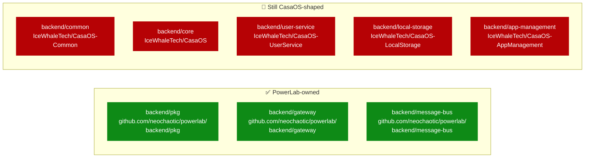

# CasaOS strangler progress

Live tracker for the multi-sprint migration off `backend/common/`
(`github.com/IceWhaleTech/CasaOS-Common`) and the per-service module
rebrands. Updated each kill PR.

## Current state — Sprint 1 (in progress)

## Per-sprint checklist

### Sprint 1 — v0.4.0 target

- [x] `pkg/logging` foundation (#68 → PR #75)
- [x] `pkg/errors` foundation (#69 → PR #77)
- [x] `pkg/lifecycle` foundation (#70 → PR #78)
- [x] `pkg/tracing` foundation (#71 → PR #79)
- [x] Supply chain audit (#62 → PR #80)
- [x] Kill #1: message-bus rebrand part 1 (#72 → PR #81)
- [x] Kill #2: gateway rebrand part 1 (#73 → PR #82)
- [x] install.sh distro-aware (#76 → PR #84)
- [x] Cert text-removal (PR #83)
- [ ] Kill #1: message-bus part 2 — logger swap to pkg/logging
- [ ] Kill #1: message-bus part 3 — middleware wiring
- [ ] Kill #1: message-bus part 4 — dead code per-function review
- [ ] Kill #2: gateway part 2 — logger swap to pkg/logging
- [ ] Kill #2: gateway part 3 — middleware wiring (closes #64 structurally)
- [ ] Kill #2: gateway part 4 — dead code per-function review
- [ ] Bug fixes from gateway audit: #33 mDNS Linux, #44 Tailscale SAN, #55 vdev stamp
- [ ] Bug fix #50 (CA download error UX) — closes when handlers use `pkg/errors.WriteHTTP`

### Sprint 2 — v0.5.0 target

- [ ] Kill #3: local-storage rewrite + parts 2-4
- [ ] Kill #4: user-service rewrite + parts 2-4
- [ ] **Features:** Logs UI · Privacy statement (#31) · Updater shell fallback (#61) · Screenshots refresh (#60)
- [ ] Bug fixes: #34 tus.io upload · #35 JWT cookie · #36 per-user fs sandbox · #38 file type · #39 CSP+RFC6266 · #57 editor inert
- [ ] Playwright E2E baseline (#86)

### Sprint 3 — v0.6.0 target

- [ ] Kill #5: core rewrite + parts 2-4
- [ ] Appstore migration off CasaOS aliyuncs hosting
- [ ] **Features:** Network observability widget (#47) · HTTPS one-tap polish (#40, no-text) · Docker missing graceful (#63)

### Sprint 4 — v1.0 target

- [ ] Kill #6: app-management rewrite + parts 2-4 (the mountain)
- [ ] CasaOS coexistence polish (#85): Docker labels + AppData isolation
- [ ] **Features:** First-run onboarding tour (#30) · Custom App name polish (#58) · Files Delete UX (#66)
- [ ] **Delete `backend/common/`** — last importer is gone
- [ ] **Sprint 4.5: stabilization window** — extensive E2E, all bugs cleared, alignment with user before tagging

### v1.0

- [ ] All seven backend modules at `github.com/neochaotic/powerlab/backend/*`
- [ ] Zero CasaOS module paths anywhere in the tree
- [ ] User explicit approval (per persistent rule — never tag without alignment)

## Counters

| Metric | v0.3.x | v0.4.0 (current target) | v1.0 (target) |
|---|---:|---:|---:|
| Modules PowerLab-owned | 0 | 3 | 8 |
| Modules CasaOS-shaped | 8 | 5 | 0 |
| `backend/common/` importers | 6 | 4 | 0 |
| Inherited dead funcs | 368 | ~341 (after Sprint 1 delete pass) | < 50 |

## Reference

- Roadmap umbrella: #67
- Audit: `docs/audits/`
- ADR-0025 — strangler pattern justification
