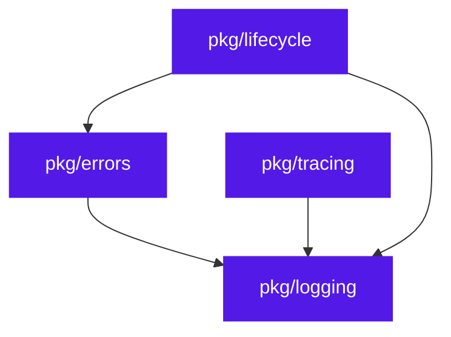
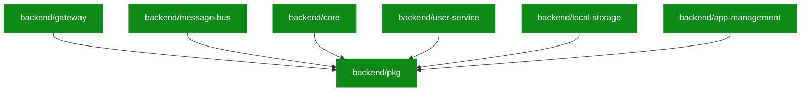

# Dependency graph

Go-module-level dependencies between PowerLab's backend modules. Each
node is a Go module (a `go.mod` file); arrows point from importer to
importee.

## Current state (after Sprint 1)

```mermaid
flowchart TD
    %% PowerLab-owned
    PKG[backend/pkg<br/>github.com/neochaotic/powerlab/<br/>backend/pkg]:::powerlab
    GATEWAY[backend/gateway<br/>github.com/neochaotic/powerlab/<br/>backend/gateway]:::powerlab
    MSGBUS[backend/message-bus<br/>github.com/neochaotic/powerlab/<br/>backend/message-bus]:::powerlab

    %% Still CasaOS-shaped
    COMMON[backend/common<br/>github.com/IceWhaleTech/<br/>CasaOS-Common]:::casaos
    CORE[backend/core<br/>github.com/IceWhaleTech/<br/>CasaOS]:::casaos
    USER[backend/user-service<br/>github.com/IceWhaleTech/<br/>CasaOS-UserService]:::casaos
    LOCAL[backend/local-storage<br/>github.com/IceWhaleTech/<br/>CasaOS-LocalStorage]:::casaos
    APP[backend/app-management<br/>github.com/IceWhaleTech/<br/>CasaOS-AppManagement]:::casaos

    %% Dependencies
    GATEWAY --> COMMON
    MSGBUS --> COMMON
    CORE --> COMMON
    USER --> COMMON
    LOCAL --> COMMON
    APP --> COMMON

    %% pkg/errors imports pkg/logging (CorrelationIDKey shared)
    %% pkg/tracing imports pkg/logging (CorrelationIDKey shared)
    %% pkg/lifecycle imports pkg/logging + pkg/errors

    classDef powerlab fill:#0e8a16,stroke:#0e8a16,color:#fff
    classDef casaos fill:#b60205,stroke:#b60205,color:#fff
```

**Legend:**

- 🟢 Green = PowerLab-owned (`github.com/neochaotic/powerlab/...`)
- 🔴 Red = still CasaOS-shaped (`github.com/IceWhaleTech/CasaOS-*`),
  pending kill in Sprint 2-4

After Sprint 1: 3 modules PowerLab-owned, 5 modules pending. The new
`backend/pkg/` foundation coexists with `backend/common/` (strangler
pattern, ADR-0025); each subsequent kill removes one importer of
`common` and adds one consumer of `pkg`.

## Foundation packages — internal dependency

The four `pkg/*` foundation packages compose without circular deps:

`pkg/logging` is the leaf — every other foundation package depends on
it. `pkg/lifecycle` is the root composer (HTTP recovery middleware
needs both `pkg/logging` for logs and `pkg/errors` for the 500
response shape). Services pull from any subset they need.

## End-state target (after Sprint 4)

When the strip is complete, every backend module is PowerLab-owned and
`backend/common/` is deleted:

All seven modules importing from `backend/pkg/` (PowerLab foundation)
only. Zero CasaOS module paths anywhere in the tree. This is the
**v1.0 architecture**.

## Per-sprint progress tracker

Updated as each kill lands. See `casaos-strangler.md` for the live
checklist.

| Sprint | Modules killed (cumulative) | `common/` importers remaining |
|---|---|---:|
| 0 (v0.3.x) | none | 6 |
| 1 (v0.4.0) | gateway, message-bus | 4 |
| 2 (v0.5.0 target) | + local-storage, user-service | 2 |
| 3 (v0.6.0 target) | + core | 1 |
| 4 (v1.0 target) | + app-management → delete `common/` | 0 |
