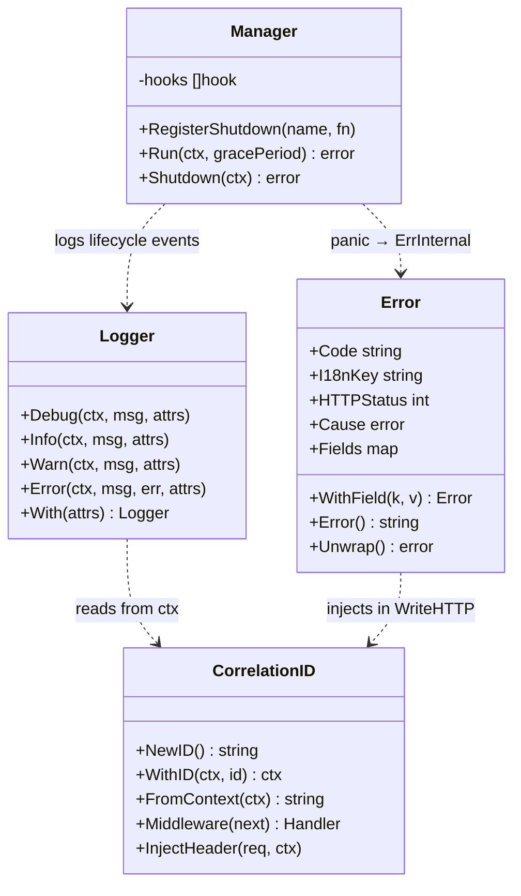

# Foundation interfaces

The four `backend/pkg/*` packages compose into the spine that every
PowerLab service uses. This document is the **relationship view** —
godoc is the contract reference (run `go doc github.com/neochaotic/powerlab/backend/pkg/<name>`
for any package).

## Composition



Dotted arrows are runtime dependencies (not imports — the lifecycle
package imports `pkg/logging` and `pkg/errors`, but the others don't
import each other).

## Why these four (and only these four)

Each package targets a specific class of failure observed in the
v0.3.x line:

| Package | Closes class of failure | Concrete bug it would have prevented |
|---|---|---|
| `pkg/logging` | "Where does this log line come from?" | Generic stdout dumps without correlation |
| `pkg/errors` | "What does this 500 mean?" | #50 — Settings → Security plain-text error page |
| `pkg/lifecycle` | "Why did the gateway crash?" | #64 — `checkURL` SIGSEGV took down whole process |
| `pkg/tracing` | "Which user action triggered this?" | Multi-service triage (no shared correlation ID) |

## Composition example: a wired-up service

A typical PowerLab service `main.go` after Sprint 1 wires all four:

```go
package main

import (
    "context"
    "net/http"
    "time"

    "github.com/neochaotic/powerlab/backend/pkg/lifecycle"
    "github.com/neochaotic/powerlab/backend/pkg/logging"
    "github.com/neochaotic/powerlab/backend/pkg/tracing"
)

func main() {
    logger, err := logging.New(logging.Config{
        Level:  os.Getenv("POWERLAB_LOG_LEVEL"),
        Format: os.Getenv("POWERLAB_LOG_FORMAT"),
    })
    if err != nil {
        panic(err)
    }

    mux := http.NewServeMux()
    // ... register handlers ...

    // Outermost: tracing (mints/echoes correlation IDs).
    // Inner: panic recovery (logs panics + writes 500 via pkg/errors).
    handler := tracing.Middleware(
        lifecycle.RecoverMiddleware(logger)(mux),
    )

    server := &http.Server{
        Addr:    ":8443",
        Handler: handler,
    }

    mgr := lifecycle.New(logger)
    mgr.RegisterShutdown("http-server", func(ctx context.Context) error {
        return server.Shutdown(ctx)
    })

    go func() {
        if err := server.ListenAndServeTLS("", ""); err != nil {
            logger.Error(context.Background(), "server exited", err)
        }
    }()

    if err := mgr.Run(context.Background(), 30*time.Second); err != nil {
        logger.Error(context.Background(), "shutdown error", err)
    }
}
```

## What the four packages refuse to do

- **No `Fatal` in `pkg/logging`.** Termination is `pkg/lifecycle`'s
  job. Logging is observation, not control flow.
- **No domain-specific errors in `pkg/errors`** (e.g.
  `ErrPortsConflict` lives with the compose service, not in the
  foundation package).
- **No third-party panic catcher in `pkg/lifecycle`.** Stdlib
  `recover()` is enough; adding a dep would defeat the foundation
  hygiene principle.
- **No distributed tracing in `pkg/tracing`** (no W3C `traceparent`,
  no spans, no parent links). Plain correlation ID end-to-end is
  enough for the self-hosted envelope.

## Reference

- `backend/pkg/logging/logger.go` — Logger interface + slog handler
  composition
- `backend/pkg/errors/errors.go` — Error struct, catalog, WriteHTTP
- `backend/pkg/lifecycle/manager.go` — Manager + Shutdown semantics
- `backend/pkg/lifecycle/middleware.go` — RecoverMiddleware + SafeGo
- `backend/pkg/tracing/tracing.go` — NewID, Middleware, InjectHeader
- ADRs 0011-0015 — design rationale for each
