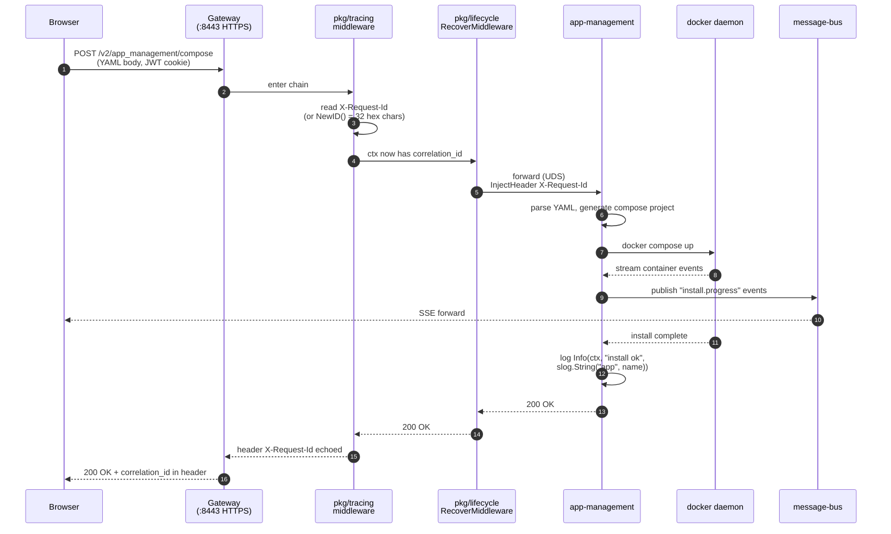
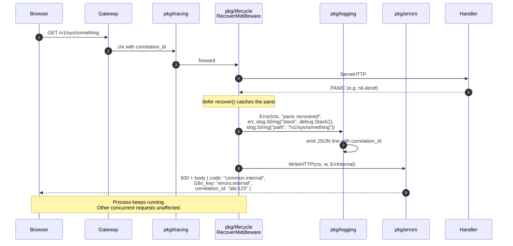
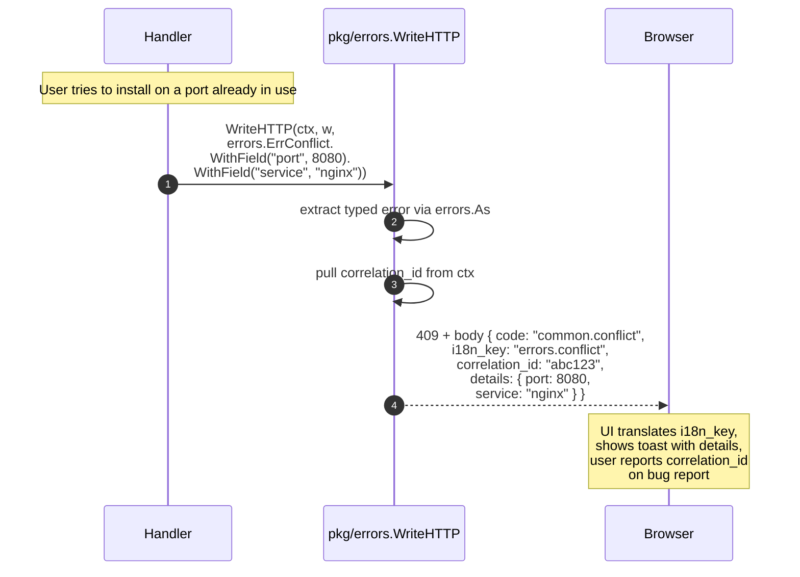

# Request lifecycle

How a single HTTP request travels through PowerLab — what handles it
at each layer, where the correlation ID is generated, and how
errors are surfaced.

## Happy path: app install

Every log line in every service the request touches carries the same
`correlation_id`. Greppping a single 32-char hex string reconstructs
the full path.

## Error path: panic recovered

When a handler panics — any nil-deref, any out-of-bounds, any
contract violation — `pkg/lifecycle.RecoverMiddleware` catches it and
turns it into a logged 500 response without taking down the process.

This is the structural fix for **bug #64** (gateway `checkURL`
SIGSEGV). Once the gateway rewrite (#73 part 3) wires
`RecoverMiddleware` at the chain's outermost layer, the inverted
condition + nil-deref produces a logged 500 instead of a process
crash.

## Error path: typed error from handler

When a handler explicitly returns an `*errors.Error`, `WriteHTTP`
serializes it with the correlation ID, the i18n key, and structured
details — the UI can translate the message and surface meaningful
context.

## Why the layers matter

| Layer | Without it | With it |
|---|---|---|
| `pkg/tracing` | Logs in different services unrelatable | One ID joins everything |
| `pkg/lifecycle.RecoverMiddleware` | Single panic crashes whole service | Panic → logged 500, service stays up |
| `pkg/errors.WriteHTTP` | Plain-text 500 page (#50 class) | Structured JSON, UI can translate |
| `pkg/logging` (`Logger.With(...)`) | `fmt.Println` debug spam | Structured search keys, correlation auto |

## Reference

- `pkg/tracing/tracing.go` — `Middleware` and `InjectHeader`
- `pkg/lifecycle/middleware.go` — `RecoverMiddleware` and `SafeGo`
- `pkg/errors/errors.go` — `WriteHTTP` and the catalog
- ADRs 0012-0015 cover the design of each foundation package
