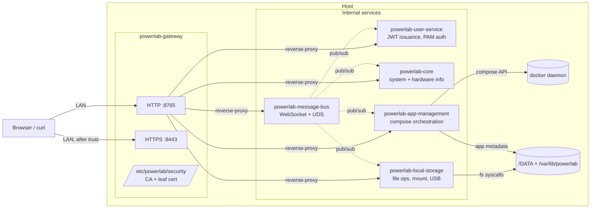

# Service topology

PowerLab runs as **seven systemd services** on a single host, all
communicating internally over Unix Domain Sockets and HTTP. The
gateway is the only externally-reachable entry point.

## Process model



The gateway is the **sole listener on TCP** — every internal service
binds to a Unix Domain Socket only. The gateway routes by URL prefix
(`/v1/sys/*` → core, `/v1/users/*` → user-service, `/v1/file/*` →
local-storage, etc.).

## Boot order

`systemd` orchestrates startup. Each service has soft dependencies
(`Wants=`) on the ones it talks to; ordering (`After=`) enforces
that dependencies are reachable before a service boots.

```mermaid
sequenceDiagram
    autonumber
    participant systemd
    participant gateway as powerlab-gateway
    participant msgbus as powerlab-message-bus
    participant userservice as powerlab-user-service
    participant core
    participant app as powerlab-app-management
    participant local as powerlab-local-storage

    systemd->>gateway: start
    gateway->>gateway: write /var/run/powerlab/management.url
    Note over gateway: HTTP up; HTTPS pending CA bootstrap

    systemd->>msgbus: start (after gateway)
    msgbus->>gateway: poll management.url for ~10s
    msgbus->>msgbus: write message-bus.url

    systemd->>userservice: start (after msgbus)
    userservice->>msgbus: dial WebSocket
    userservice->>userservice: write user-service.url

    par parallel
        systemd->>core: start (after msgbus)
        core->>msgbus: subscribe
    and
        systemd->>app: start (after msgbus)
        app->>msgbus: subscribe
    and
        systemd->>local: start (after msgbus)
        local->>msgbus: subscribe
    end

    Note over systemd,local: All services up.<br/>Browser can hit gateway.
```

**Critical detail**: each service writes a `<name>.url` sentinel file
in `/var/run/powerlab/` once it's listening. Downstream services poll
those sentinels with a budget (~10s) before giving up. This is the
mechanism that makes systemd's soft-`Wants=` actually safe — a
service that boots before its dependency dies cleanly instead of
wedging.

## Service ownership

| Service | Listens on | Talks to | Owns on disk |
|---|---|---|---|
| `gateway` | `:8765` HTTP, `:8443` HTTPS | every internal service | `/etc/powerlab/security/` (CA + leaf cert), `/etc/powerlab/.hsts-armed` |
| `message-bus` | `/tmp/message-bus.sock`, WebSocket | every subscriber | `/var/lib/powerlab/db/message-bus.db` |
| `user-service` | UDS | message-bus, PAM | `/var/lib/powerlab/db/user-service.db` |
| `core` | UDS | message-bus, user-service | `/var/lib/powerlab/db/casaos.db` (legacy name) |
| `app-management` | UDS | message-bus, docker | `/var/lib/powerlab/apps/`, `/var/lib/powerlab/appstore/` |
| `local-storage` | UDS | message-bus | mount points + `/DATA/` |

(Database names with `casaos.db` are legacy from the fork; renamed
during the app-management kill in Sprint 4 with a one-shot migration.)

## Why this shape

The gateway-as-only-TCP-listener pattern comes from CasaOS upstream
and we kept it because it has real benefits:

1. **One TLS termination point** — the gateway holds the cert; the
   internal services never deal with TLS.
2. **One auth boundary** — the gateway runs the JWT verification
   middleware before any backend handler sees the request.
3. **Service-level routing is configurable** — services register
   their routes with the gateway at boot via
   `POST /v1/gateway/routes`; the gateway can hot-update its routing
   table without a restart.
4. **Internal API surface is private** — UDS files are
   `/var/run/powerlab/<svc>.sock` with `0660 root:powerlab`
   permissions; nothing on the network can reach an internal service
   directly.

## Reference

- `scripts/package-linux.sh` — generates the systemd unit files
  embedding boot order
- `backend/gateway/route/management_route.go` — route registration
  endpoint that downstreams hit at boot
- ADR-0007 — internal-network-only deployment posture
