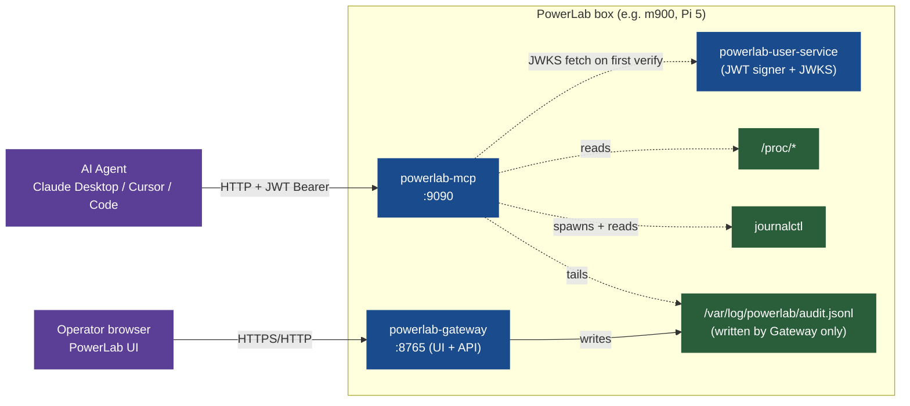
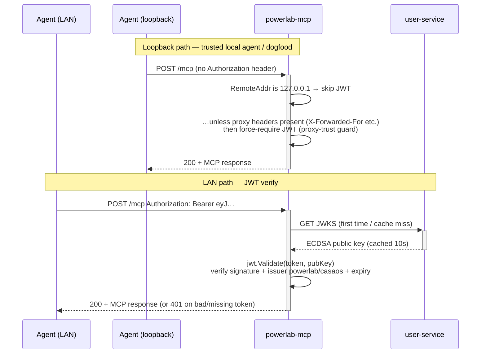

# MCP server — talk to your homelab

PowerLab ships a built-in **MCP (Model Context Protocol) server** that exposes the box's read-only observability data to AI agents — Claude Desktop, Cursor, Claude Code CLI, and any other MCP-compatible client.

The PowerLab UI is the pane of glass **for you**. The MCP server is the pane of glass **for your agent**. Same data, two surfaces.

!!! info "MVP scope (v0.7.5)"
    This is the **read-only Foundation MVP** — three resources (`system://metrics`, `journal://`, `audit://`) over the official MCP Streamable HTTP transport, gated by your PowerLab login. Destructive tools, the pairing UX, and the UI button all land in later releases. The MCP server is **isolated by design**: if it crashes, the rest of PowerLab keeps running.

## What it does (and doesn't)

### What ships today

| Resource | What an agent reads | Example question it answers |
|---|---|---|
| `system://metrics` | CPU load, memory, uptime, disk, network — from `/proc` direct | "Is my box's load average climbing?" |
| `journal://<unit>{?lines,since,priority}` | systemd journal, **PowerLab-scoped only** (cannot escape to SSH/PAM/etc.) | "Why did powerlab-gateway restart 10 minutes ago?" |
| `journal://schema` | self-describing journal field reference + ADR-0013 error codes | (used by the agent to understand what it just read) |
| `audit://recent{?limit}` | newest entries of the gateway's audit trail (`/var/log/powerlab/audit.jsonl`) | "What was the last admin action on the box?" |
| `audit://action/{correlation_id}` | every audit record tied to a single request ID — the whole cascade | "Trace what happened after the user clicked 'Install Plex'" |
| `audit://schema` | record-shape + parameter reference | (self-describing) |

### What's **NOT** in MVP

- **No destructive tools.** No `restart_app`, no `prune_orphans`, no `reset_audit`. MCP "tools" land in a later release with their own threat-model review.
- **No write paths whatsoever.** The MVP is 100% read. It cannot start, stop, install, delete, or restart anything.
- **No automatic pairing UX.** Connecting Claude Desktop to your PowerLab requires manually pasting a JWT into your client config. A `powerlab pair` CLI that mints + shows the token is roadmap.
- **No internet exposure.** The server binds `:9090` on the LAN. Loopback is unauthenticated (trusted local agent); LAN requires a PowerLab JWT. PowerLab does **not** configure port-forwarding for you.
- **No RBAC.** Any user with a valid PowerLab JWT has the same access. Today every PowerLab user is hardcoded `admin` anyway (see [ADR-0034](../decisions/0034-standalone-observability-mcp-service.md) amendment). Real role-based access is backlog [#603](https://github.com/neochaotic/powerlab/issues/603).
- **No Docker / message-bus integration.** The MCP service is deliberately isolated — no shared state with the rest of the stack.

## Product positioning

PowerLab is a **single pane of glass for your homelab** — apps, files, dashboards, store, the whole hardware nightstand. The MCP surface is **complementary**, not a pivot. Goals:

1. **Keep the homelab essence intact.** Nothing about the human UI changes because MCP exists.
2. **Open a parallel surface for agents.** Same data, different consumer (machine instead of human).
3. **Stay isolated.** MCP runs in its own process, on its own port, with soft systemd dependencies. If it explodes, the rest keeps working.
4. **Bring "observability-first" to the AI-on-Linux story.** Agents that can read your box's metrics + logs + audit trail are dramatically more useful than agents flying blind.

## Architecture

### Topology



Key invariants:

- **MCP has no upstream**. It depends on gateway + user-service only for **soft** systemd ordering (`After=`/`Wants=`, not `Requires=`). If MCP fails to boot, gateway/core/etc. continue unaffected.
- **Audit is single-source**. Only the gateway runs the audit middleware (ADR-0033). MCP **tails** the file read-only.
- **JWKS is cached**. MCP fetches the user-service public key once per 10 seconds, then reuses it — so MCP's auth gate works even if user-service is briefly down.
- **Journal scope is hard-coded to powerlab units**. The MCP `journal://` package prefixes any requested unit with `powerlab-` and suffixes `.service` — an agent cannot escape to read `/var/log/auth.log` or the kernel ring buffer.

### The wire protocol

powerlab-mcp speaks the **MCP Streamable HTTP transport** (2025-06-18 spec) at `POST /mcp` — the single endpoint pattern Anthropic standardised after the original SSE-only design. Messages are JSON-RPC 2.0 under the hood; the SDK abstracts the framing.

Two control endpoints sit alongside `/mcp` for systemd + monitoring:

| Endpoint | Auth | What it returns |
|---|---|---|
| `GET /healthz` | open | `{"status":"ok"}` — used by `Type=notify` startup probe & operators |
| `GET /version` | open | ldflags-injected `{version, commit, date}` — proves which build is running |
| `POST /mcp` | two-tier | the Streamable HTTP transport |

Why `/healthz` and `/version` stay open: a probe that needs a token is not a probe. They expose no operator data — `/version` just says "powerlab-mcp 0.7.5 commit abc1234".

### The auth flow

powerlab-mcp's gate is **two-tier**: loopback is trusted, LAN requires a PowerLab JWT.



The **proxy-trust guard** is the subtle bit. `jwt.HTTPJWT` skips auth on `RemoteAddr ∈ {127.0.0.1, ::1}` — but if MCP is ever fronted by a same-host reverse proxy, every LAN request arrives looking like loopback. Mitigation: the gate detects proxy headers (`X-Forwarded-For`, `X-Real-IP`, `Forwarded`) on a "loopback" connection, rewrites `RemoteAddr` to a sentinel (`192.0.2.1`, TEST-NET-1), and forces the JWT path. Net effect: even if you accidentally proxy MCP, it fails closed instead of bypassing auth.

### Resource model

Resources are advertised via MCP `resources/list` and read via `resources/read`. Schemas use the SDK's code-first model (`*mcp.Resource{URI, Name, Description, MIMEType}`) — no separate YAML or OpenAPI step.

URI templates follow [RFC 6570](https://datatracker.ietf.org/doc/html/rfc6570) form-style query expansion:

- `journal://{unit}{?lines,since,priority}` — `unit` is path-segment, the query keys are optional
- `audit://recent{?limit}` — `limit` is optional, defaults to 100, capped at 1000
- `audit://action/{correlation_id}` — `correlation_id` is path-segment

An agent that doesn't understand templates can still call concrete URIs (`journal://core?lines=200`) directly. The smoke client (see below) skips template URIs because there's no canonical concrete read to verify them with.

### Journey of a resource read

What happens when Claude Desktop asks for `journal://gateway?lines=10`:

```mermaid
sequenceDiagram
    autonumber
    participant C as Claude Desktop
    participant H as powerlab-mcp HTTP handler
    participant G as Auth gate
    participant B as Body limit
    participant T as Streamable transport
    participant S as MCP server (SDK)
    participant J as journal package
    participant CTL as journalctl

    C->>H: POST /mcp Authorization: Bearer eyJ…<br/>JSON-RPC: resources/read URI=journal://gateway?lines=10
    H->>G: gated handler
    G->>G: not loopback + no proxy headers → JWT verify
    G->>G: jwt.Validate → claims OK
    G->>B: pass to MaxBytesReader (1 MiB cap)
    B->>T: stream into Streamable HTTP handler
    T->>S: parse JSON-RPC, dispatch to registered template
    S->>J: BuildArgs(Query{Unit: "gateway", Lines: 10})
    J->>J: canonicalUnit("gateway") → "powerlab-gateway.service"<br/>(hard scope; agent cannot escape)
    J->>CTL: journalctl -u powerlab-gateway.service -o json --no-pager -n 10
    CTL-->>J: NDJSON stream
    J->>S: parsed []Entry
    S->>T: MCP ResourceContents (text/json)
    T->>H: HTTP response framed
    H-->>C: 200 + ResourceContents
```

The numbered steps mirror the package layout:
1-2: `server.Handler()` mux entry → gated handler chain
3-4: `preventProxyLoopbackTrust` + `jwt.HTTPJWT` from `backend/common/utils/jwt`
5: `http.MaxBytesReader` 1 MiB cap (DoS protection — MCP messages are tiny)
6: SDK's `StreamableHTTPHandler` (official `modelcontextprotocol/go-sdk`)
7: `server/resources_journal.go` `registerJournal` callback
8: `journal/journal.go` `BuildArgs` + `canonicalUnit`
9: `journal/exec.go` (separate file so tests inject a `Runner`)
10-11: response goes back through the same chain

### Defense in depth

| Layer | Mitigation |
|---|---|
| Bind address | `:9090` — distinct from gateway (`:8765`) so no port conflict + no shared TLS |
| Body limit | `http.MaxBytesReader` 1 MiB on `/mcp` — MCP messages are tiny, an unbounded POST is OOM/DoS, unauthenticated from loopback |
| Loopback trust | Only `RemoteAddr ∈ {127.0.0.1, ::1}` — IPv6 brackets handled via `net.SplitHostPort` |
| Proxy-trust guard | Proxy headers on a "loopback" connection rewrite `RemoteAddr` to TEST-NET-1 + force JWT (fail-closed) |
| JWT verification | ECDSA via `jwt.Validate` — same gate the rest of the stack uses; issuer must be `powerlab` or `casaos` |
| JWKS source | `external.GetPublicKey(cfg.RuntimePath)` — single-source, 10s cache |
| Journal scope | `canonicalUnit` hard-prefixes `powerlab-` + `.service` — agent cannot escape to system units |
| Audit access | Read-only tail (`audittail` package). The writer is the gateway, not MCP. File is `root:root 0600` — MCP runs as root (only via the systemd unit) to read it |
| Kill-switch | `Disabled = true` in `mcp.conf` — service exits 0 before binding; operator opt-out without `systemctl mask` |

## Test recipes

### Quick: from the box itself (loopback, no JWT)

The loopback path skips JWT, so you can verify MCP is alive without paring anything:

```bash
# Health + version (the systemd unit + monitoring use these)
curl -sf http://127.0.0.1:9090/healthz && echo "  /healthz OK"
curl -sf http://127.0.0.1:9090/version | jq .

# JSON-RPC: list every resource MCP advertises
curl -sf http://127.0.0.1:9090/mcp \
  -H 'Content-Type: application/json' \
  -H 'Accept: application/json, text/event-stream' \
  -H 'MCP-Protocol-Version: 2025-06-18' \
  -d '{"jsonrpc":"2.0","id":1,"method":"resources/list"}' | jq .

# Read a specific resource (system://metrics is always available)
curl -sf http://127.0.0.1:9090/mcp \
  -H 'Content-Type: application/json' \
  -H 'Accept: application/json, text/event-stream' \
  -H 'MCP-Protocol-Version: 2025-06-18' \
  -d '{"jsonrpc":"2.0","id":2,"method":"resources/read","params":{"uri":"system://metrics"}}' | jq .
```

### From your laptop (LAN, needs a JWT)

```bash
# 1. Get a JWT from the user-service (login, returns access_token)
JWT=$(curl -sf http://<box-ip>:8765/v1/users/login \
  -H 'Content-Type: application/json' \
  -d '{"username":"<your-os-username>","password":"<your-os-password>"}' \
  | jq -r '.data.token.access_token')

# 2. Hit MCP with the JWT
curl -sf http://<box-ip>:9090/mcp \
  -H "Authorization: Bearer $JWT" \
  -H 'Content-Type: application/json' \
  -H 'Accept: application/json, text/event-stream' \
  -H 'MCP-Protocol-Version: 2025-06-18' \
  -d '{"jsonrpc":"2.0","id":1,"method":"resources/list"}' | jq .
```

### Comprehensive: the Go smoke client

`backend/powerlab-mcp/cmd/smoke/main.go` uses the official MCP SDK to connect, list, and read every advertised resource — the same code path real agents use:

```bash
# Loopback (run on the box itself)
cd backend/powerlab-mcp
go run ./cmd/smoke

# LAN (from your laptop, with a JWT from step 1 above)
go run ./cmd/smoke \
    -endpoint http://192.168.1.42:9090 \
    -token "$JWT"
```

Sample output (every line is a check):

```
PASS  /healthz + /version
PASS  mcp connect + initialize
PASS  resources/list (6 advertised)
PASS  system://metrics (412 bytes)
PASS  audit://recent (1832 bytes)
PASS  audit://schema (514 bytes)
PASS  journal://schema (322 bytes)
SKIP  journal://{unit}{?lines,since,priority} (URI template — provide a concrete read separately)
SKIP  audit://action/{correlation_id} (URI template — provide a concrete read separately)

OK — every advertised resource read successfully
```

Exit code is 0 on full pass, non-zero on any failure — slot it into a release-cut pre-flight or a systemd timer.

## Wiring an MCP client

### Claude Desktop

`~/Library/Application Support/Claude/claude_desktop_config.json` (macOS) — add the box under `mcpServers`:

```json
{
  "mcpServers": {
    "powerlab-home": {
      "transport": {
        "type": "http",
        "url": "http://<box-ip>:9090/mcp",
        "headers": {
          "Authorization": "Bearer <JWT-from-login>"
        }
      }
    }
  }
}
```

Restart Claude Desktop. Resources show up in the conversation under "Resources" → "powerlab-home".

### Claude Code CLI

```bash
claude mcp add powerlab-home \
  --transport http \
  --url "http://<box-ip>:9090/mcp" \
  --header "Authorization: Bearer $JWT"
```

### Cursor

`~/.cursor/mcp.json` follows the same shape as Claude Desktop's `mcpServers` block.

!!! warning "JWTs expire"
    PowerLab access tokens last 3 hours. You'll need to refresh the token in your client config periodically. The pairing UX (auto-renewing token via a CLI flow) is roadmap.

## Operator controls

### Disabling MCP without uninstalling

Flip the kill-switch in `/etc/powerlab/mcp.conf`:

```ini
Disabled = true
```

Then `sudo systemctl restart powerlab-mcp`. The binary logs a single notice and exits 0 **before binding** — systemd records it as a successful start and does not restart-loop. To re-enable, flip back and restart.

Why not `systemctl disable powerlab-mcp`? You can, but the config kill-switch survives the `--upgrade` install path (configs are preserved), so it's the cleaner pattern for "I never want MCP running here".

### Logs

```bash
journalctl -u powerlab-mcp -f
```

Every request is logged as JSON via `log/slog`. Real audit (recorder dogfood — MCP writing its own actions to `audit.jsonl`) is the next phase item.

### Binding off `:9090`

If `:9090` conflicts on your box, edit `mcp.conf`:

```ini
ListenAddr = 127.0.0.1:9595
```

Restart MCP. Note that binding to `127.0.0.1` only blocks LAN access entirely — agents would have to come in via SSH tunnel.

## Roadmap (what's NOT in MVP)

Tracked as GitHub issues — none blocking the v0.7.5 cut:

- [**#594**](https://github.com/neochaotic/powerlab/issues/594) — `jwt.HTTPJWT` IPv6 loopback misclassification + JWKS fetch timeout (affects gateway too)
- [**#595**](https://github.com/neochaotic/powerlab/issues/595) — minor MCP hardening (audit-IP logging, server timeouts, `/version` info-disclosure)
- [**#596**](https://github.com/neochaotic/powerlab/issues/596) — real non-SDK pairing test (Claude Desktop end-to-end)
- [**#597**](https://github.com/neochaotic/powerlab/issues/597) — `journal://` drops non-text `MESSAGE` lines (binary blobs)
- [**#598**](https://github.com/neochaotic/powerlab/issues/598) — wire golangci-lint A+ gate in CI
- [**#603**](https://github.com/neochaotic/powerlab/issues/603) — real RBAC (admin tier) — backlog after MVP

Beyond that, the **Foundation MVP** (ADR-0034) tracks:
- Tools — `restart_app`, `prune_orphans`, `check_disk_free`, `read_file`, `journal_search`, `reset_audit`
- Audit-recorder dogfood (MCP writes its own actions into `audit.jsonl`)
- `powerlab-logs` CLI as an MCP client of itself
- UI header button

## References

- [ADR-0034](../decisions/0034-standalone-observability-mcp-service.md) — Standalone observability + MCP service (the source of record)
- [ADR-0033](../decisions/0033-audit-system-design.md) — Audit middleware + JSONL design
- [ADR-0035](../decisions/0035-audit-jsonl-migration.md) — SQLite → JSONL migration that enables `audit://`
- [Model Context Protocol spec](https://modelcontextprotocol.io) — the protocol PowerLab implements
- [`modelcontextprotocol/go-sdk`](https://github.com/modelcontextprotocol/go-sdk) — the official Go SDK powerlab-mcp builds on
