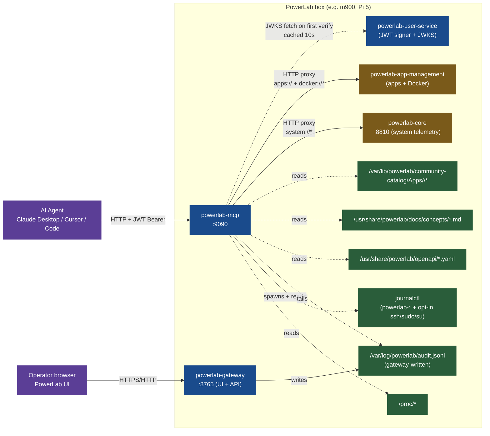
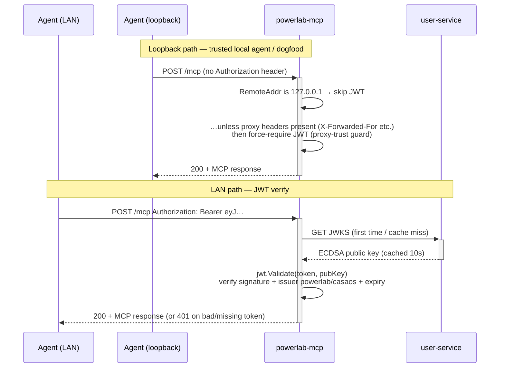
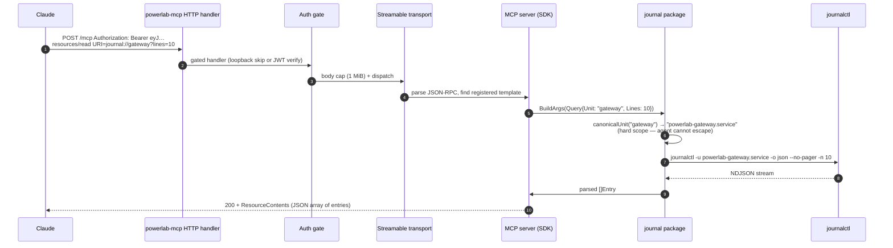
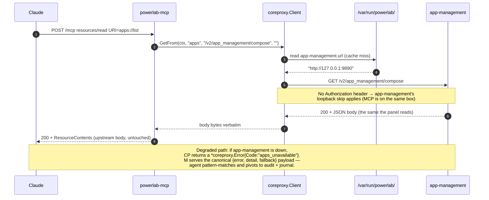

# MCP server — talk to your homelab

PowerLab ships a built-in **MCP (Model Context Protocol) server** that exposes the box's read-only observability + app surface to AI agents — Claude Desktop, Cursor, Claude Code CLI, and any other MCP-compatible client.

The PowerLab UI is the pane of glass **for you**. The MCP server is the pane of glass **for your agent**. Same data, two surfaces.

!!! info "Current scope (25 advertised resources + 1 MCP Prompt + 4 always-on tools)"
    Read-mostly across the **whole PowerLab observability + apps + Docker + compose-catalog surface**. Sysadmin telemetry (CPU, RAM, disk, network, GPU, temperature, SMART, kernel/OS identity, systemd services, processes, OS updates) thin-proxies through core; installed-apps + container logs + raw Docker daemon visibility thin-proxy through app-management; audit trail, PowerLab service journals, concept docs, and the 137-app compose catalog are read directly so they survive any other service being down. One opt-in sensitive tier exposes host auth journals (ssh/sudo/su) behind an mcp.conf flag. Destructive tools (`install_app` / `uninstall_app`) are gated behind a separate mcp.conf flag and a compose deny-list validator. The `compose_authoring` MCP Prompt bundles conventions + 3 catalog examples + validator rules to ground an agent designing a new compose YAML in one round-trip.

## What ships today

25 resources advertised on `resources/list` + 6 URI templates on `resources/templates/list` + 1 prompt + 4 always-on tools (+2 destructive tools when opted in). Surface grouped by namespace.

Resources by namespace:

| Namespace | Resource | Where the data comes from |
|---|---|---|
| **system://** (10) | `system://schema` | self-describing index |
| | `system://metrics` | `/proc` direct (mem + load + uptime + cores) |
| | `system://utilization` | proxy → core `/v1/sys/utilization` (CPU% + temp + power + model + mem + net) |
| | `system://disk` | proxy → core `/v1/sys/disk` (physical + per-mount + SMART) |
| | `system://network` | proxy → core `/v1/sys/network/interfaces` (per-interface state + addresses) |
| | `system://gpu` | direct import — Apple Silicon (ioreg) + Nvidia (nvidia-smi); empty model = no GPU |
| | `system://services` | proxy → core `/v1/sys/services` (ActiveState + SubState per powerlab-* unit; core whitelists the unit set) |
| | `system://kernel` | proxy → core `/v1/sys/host` (kernel release + arch + distro + boot time + virtualization) |
| | `system://processes` | proxy → core `/v1/sys/processes` (count + top 10 by CPU and mem; **name only — no cmdline**, argv leaks secrets) |
| | `system://updates` | direct in MCP — `apt list --upgradable` (Debian/Ubuntu); `detected="none"` on other distros ([ADR-0044](../decisions/0044-mcp-hybrid-architecture-thin-proxy-to-core.md) documented exception) |
| **journal://** (5) | `journal://schema` | self-describing index |
| | `journal://units` | discovery — lists installed `powerlab-*.service` stems |
| | `journal://{unit}{?lines,since,priority}` (template) | `journalctl -u powerlab-<unit>.service` — **scope-locked to PowerLab units** |
| | `journal://system/auth{?lines,since}` | host auth journal — `ssh.service` + `sshd.service` + `sudo` + `su` (**sensitive tier; opt-in only**, [ADR-0049](../decisions/0049-mcp-sensitive-sysadmin-tier-threat-model.md)). Wire shape: `{ts, unit, hostname, message}` — no `_PID`, no `_CMDLINE`, no `_AUDIT_SESSION`. Advertised only when `EnableSensitiveTier = true` in `mcp.conf`. |
| | `journal://system/failures{?lines,since}` | same source filtered to `PRIORITY err..warning` (the err and warning syslog levels — **sensitive tier; opt-in only**, [ADR-0049](../decisions/0049-mcp-sensitive-sysadmin-tier-threat-model.md)). |
| **audit://** (2 + 1 template) | `audit://schema` | self-describing index |
| | `audit://recent{?limit}` | tail of `/var/log/powerlab/audit.jsonl` (gateway-written) |
| | `audit://action/{correlation_id}` (template) | filter by X-Request-Id — the whole cascade of one request |
| **apps://** (2 + 5 templates) | `apps://schema` | self-describing index (catalogs the templates below) |
| | `apps://list` | proxy → app-management `/v2/app_management/compose` |
| | `apps://state/{id}` (template) | compose source + status for one app |
| | `apps://state/{id}/containers` (template) | live containers |
| | `apps://state/{id}/health` (template) | aggregate health |
| | `apps://state/{id}/stats` (template) | per-container CPU/RAM/IO |
| | `apps://state/{id}/disk` (template) | per-app disk footprint |
| **docker://** (5 + 1 template) | `docker://containers` | all containers on the daemon (PowerLab + non-PowerLab) — `docker ps -a` equivalent ([ADR-0045](../decisions/0045-mcp-apps-docker-via-app-management-http-proxy.md) extension, [#630](https://github.com/neochaotic/powerlab/issues/630)) |
| | `docker://images` | all local images — id, tags[], size, created_at |
| | `docker://networks` | all networks — name, driver, scope, IPAM, attached containers |
| | `docker://volumes` | all volumes — name, driver, mountpoint, size (bytes; `-1` when daemon can't compute — [#645](https://github.com/neochaotic/powerlab/issues/645)), in_use_by[]{id,name} (containers mounting the volume) |
| | `docker://system` | daemon info + `docker system df` snapshot — version, container/image counts, disk_usage by category |
| | `docker://logs/{id}` (template) | proxy → app-management's `ComposeAppLogs` — **MCP never touches the Docker socket** ([ADR-0045](../decisions/0045-mcp-apps-docker-via-app-management-http-proxy.md)) |
| **catalog://** (1 + 1 template) | `catalog://index` | 137 compose YAMLs in the bundled `community-catalog/Apps/` — pattern reference, NOT something to install ([ADR-0048](../decisions/0048-mcp-docs-surface-compose-authoring.md)) |
| | `catalog://app/{id}` (template) | raw docker-compose.yml of one catalog app — agent reads as a worked example |
| **docs://** (2 + 2 templates) | `docs://api` | manifest of bundled OpenAPI specs |
| | `docs://api/{service}` (template) | raw OpenAPI YAML for one service — Scalar-equivalent for agents |
| | `docs://concepts/index` | manifest of bundled concept docs — `compose-conventions`, `glossary`, `mcp-server`, `security-model` ([ADR-0048](../decisions/0048-mcp-docs-surface-compose-authoring.md)) |
| | `docs://concepts/{name}` (template) | raw markdown of one concept doc — path-traversal hardened |

URI templates do not appear in `resources/list` (per the MCP spec) — they're advertised on `resources/templates/list` and exercised by URI binding on `resources/read`. Both `apps://schema` and `docs://concepts/index` enumerate the templates they cover so the agent's discovery flow is index → bind → read.

## Prompts (curated context bundles — ADR-0048)

powerlab-mcp exposes the **MCP Prompts primitive** alongside Resources and Tools. Prompts are server-curated message bundles the agent can fetch via `prompts/get`; they're how the protocol expresses "here's the pre-assembled context you need to do task X well". This is the killer feature for compose authoring.

| Prompt | Arguments | What you get back |
|---|---|---|
| `compose_authoring` | `app_type` (optional; one of `database`, `media`, `ai`, `dashboard`, or empty for a representative trio) | A 6-message bundle: (1) framing user message; (2) the canonical `compose-conventions` doc; (3) example catalog YAML #1; (4) example #2; (5) example #3; (6) the composevalidator deny-list with REJECTS-FORMAT semantics + a final instruction to ask the user for specifics and propose a PowerLab-idiomatic compose. |

One `prompts/get` invocation replaces what would otherwise be ~5–10 `resources/read` round-trips. The agent receives the conventions, the worked examples, and the deny-list in a single grounded context — then drafts a YAML, optionally calls `install_app` with `dry_run=true` to dry-run it against the same validator, optionally calls `install_app` for real (with the destructive gate on).

### Why a Prompt and not just resource reads

The MCP Prompts primitive is rendered distinctly by clients (Claude Desktop's "Use prompt" picker, Claude Code's `/mcp` command) — operators trigger it by name rather than the agent having to know which N resources to chain. It's also a stable contract: when we add a 5th compose example or amend the deny-list, the prompt picks up the new bundle without the agent changing its discovery strategy. ADR-0048 §3 walks through the alternatives considered (full-spec dump into system prompt → rejected; auto-gen from OpenAPI → out of scope for the doc surface).

## What's NOT in scope yet

- **No pairing UX.** Connecting Claude Desktop today still means pasting a JWT into the client config by hand. A `powerlab pair` CLI that mints + displays the token is roadmap ([#596](https://github.com/neochaotic/powerlab/issues/596)).
- **No internet exposure.** Bind is `:9090` on the LAN, gated by JWT. PowerLab does not configure port-forwarding for you.
- **No RBAC.** Any user with a valid PowerLab JWT has the same access. Today every PowerLab user is hardcoded `admin` anyway (see the [ADR-0034 amendment](../decisions/0034-standalone-observability-mcp-service.md)). Real role-based access is backlog [#603](https://github.com/neochaotic/powerlab/issues/603).
- **No agent-identity forwarding (yet).** Today every MCP-to-upstream call hits the upstream's loopback skip — the upstream's audit trail records "loopback" for the call, not the agent's user. JWT forwarding + audit dogfood lands per [ADR-0047](../decisions/0047-mcp-agent-identity-propagation.md) — design accepted, implementation queued.
- **No panel-side approval UI for destructive tools.** `install_app` + `uninstall_app` exist behind `EnableDestructiveTools`, but once the operator flips the gate the agent can act autonomously. A per-action human confirmation flow is roadmap.
- **No UI header button.** Roadmap; the resources work today via any MCP client.

## Product positioning

PowerLab is a **single pane of glass for your homelab** — apps, files, dashboards, store, the whole hardware nightstand. The MCP surface is **complementary**, not a pivot:

1. **Keep the homelab essence intact.** Nothing about the human UI changes because MCP exists.
2. **Open a parallel surface for agents.** Same data, different consumer (machine instead of human). Whatever the panel shows, the agent can read.
3. **Storage-agnostic by construction.** When PowerLab migrates from SQLite to PostgreSQL (or any future backend), MCP requires no changes — the HTTP contract of each PowerLab service is the abstraction (ADR-0045).
4. **Bring "observability-first" to the AI-on-Linux story.** Agents that can read your box's metrics + logs + audit trail + app state are dramatically more useful than agents flying blind.

## Architecture

### Hybrid: independent reads + thin proxies

powerlab-mcp uses a **hybrid architecture** — some resources read raw, others proxy to the relevant PowerLab service. The split is deliberate ([ADR-0044](../decisions/0044-mcp-hybrid-architecture-thin-proxy-to-core.md) + [ADR-0045](../decisions/0045-mcp-apps-docker-via-app-management-http-proxy.md)):

- **Independent reads** (audit + journal of PowerLab units): survive every other service being down — exactly when the operator most needs them.
- **Proxied reads** (system, apps, docker, docs): reuse the same code path the panel reads. Single source of truth. Zero duplication. Storage-agnostic.



### Key invariants

- **Audit + journal of PowerLab units stay raw.** When core or app-management are down, the agent still reads `audit://` and `journal://gateway` — exactly when the operator needs to find out *why* things are broken.
- **Proxied resources degrade with a structured payload, not an error.** When core is down `system://utilization` returns `{"error":"core_unavailable","detail":"…","fallback":"audit:// and journal:// remain readable"}`. Same shape for `apps_unavailable` when app-management is down. The agent pattern-matches and pivots.
- **Docker socket stays out of MCP.** `docker://logs/{id}` proxies through app-management's `ComposeAppLogs` (which already speaks to the Docker socket). MCP never has Docker socket access. This is [ADR-0045 win #2](../decisions/0045-mcp-apps-docker-via-app-management-http-proxy.md).
- **Journal scope is hard-coded to a fixed set of unit selectors, never agent-supplied strings.** The MCP `journal://{unit}` package prefixes any requested unit with `powerlab-` and suffixes `.service` — an agent asking for `auth.log` or `kernel` reaches the non-existent `powerlab-auth.log.service` and gets an empty result. The opt-in sensitive tier (`journal://system/auth` + `journal://system/failures`, [ADR-0049](../decisions/0049-mcp-sensitive-sysadmin-tier-threat-model.md)) is the ONLY surface that reads host auth journals, registered only when `EnableSensitiveTier = true` in `mcp.conf`, and its selectors (`ssh.service`, `sshd.service`, `sudo`, `su`) are fixed in code — the agent picks the resource URI, not the unit name. Net invariant: PowerLab units always; host auth journals when the operator opts in; nothing else, ever.
- **JWKS is cached.** MCP fetches the user-service public key once per 10 seconds, then reuses it — auth gate works even if user-service is briefly down.
- **Storage-agnostic.** A future SQLite → PostgreSQL migration on app-management requires zero changes in MCP. The HTTP contract is the abstraction; storage is an implementation detail the owner service handles.

### The wire protocol

powerlab-mcp speaks the **MCP Streamable HTTP transport** (2025-06-18 spec) at `POST /mcp` — the single endpoint pattern Anthropic standardised after the original SSE-only design. Messages are JSON-RPC 2.0 under the hood; the SDK abstracts the framing.

Two control endpoints sit alongside `/mcp` for systemd + monitoring:

| Endpoint | Auth | What it returns |
|---|---|---|
| `GET /healthz` | open | plain text `ok\n` (Content-Type `text/plain`) — cheapest possible probe |
| `GET /version` | open | ldflags-injected `{"version":"…","commit":"…","date":"…"}` — proves which build is running |
| `POST /mcp` | two-tier | the Streamable HTTP transport (response is Server-Sent Events; messages framed as `event: message\n data: <JSON-RPC>`) |

Why `/healthz` and `/version` stay open: a probe that needs a token is not a probe. They expose no operator data — `/version` just says "powerlab-mcp 0.7.6 commit abc1234". A development build (no ldflags) reports the three fields as the literal string `"private build"`.

### The auth flow

powerlab-mcp's gate is **two-tier**: loopback is trusted, LAN requires a PowerLab JWT.



The **proxy-trust guard** is the subtle bit. `jwt.HTTPJWT` skips auth on `RemoteAddr ∈ {127.0.0.1, ::1}` — but if MCP is ever fronted by a same-host reverse proxy, every LAN request arrives looking like loopback. Mitigation: the gate detects proxy headers (`X-Forwarded-For`, `X-Real-IP`, `Forwarded`) on a "loopback" connection, rewrites `RemoteAddr` to a sentinel (`192.0.2.1`, TEST-NET-1), and forces the JWT path. Net effect: even if you accidentally proxy MCP, it fails closed instead of bypassing auth.

### Journey of an independent read

Reading `journal://gateway?lines=10`:



### Journey of a proxied read

Reading `apps://list`:



### Defense in depth

| Layer | Mitigation |
|---|---|
| Bind address | `:9090` — distinct from gateway (`:8765`), no port conflict + no shared TLS |
| Body limit | `http.MaxBytesReader` 1 MiB on `/mcp` — MCP messages are tiny, an unbounded POST is OOM/DoS, unauthenticated from loopback |
| Loopback trust | Only `RemoteAddr ∈ {127.0.0.1, ::1}` — IPv6 brackets handled via `net.SplitHostPort` |
| Proxy-trust guard | Proxy headers on a "loopback" connection rewrite `RemoteAddr` to TEST-NET-1 + force JWT (fail-closed) |
| JWT verification | ECDSA via `jwt.Validate` — same gate the rest of the stack uses; issuer must be `powerlab` or `casaos` |
| JWKS source | `external.GetPublicKey(cfg.RuntimePath)` — single-source, 10s cache |
| Journal scope | `canonicalUnit` hard-prefixes `powerlab-` + `.service` — agent cannot escape to system units |
| Audit access | Read-only tail (`audittail` package); writer is the gateway. File is `root:root 0600` — MCP runs as root (only via the systemd unit) to read it |
| **Docker socket** | **Deliberately NOT in MCP** ([ADR-0045](../decisions/0045-mcp-apps-docker-via-app-management-http-proxy.md)). `docker://logs/{id}` proxies through app-management's HTTP API, which is the only PowerLab service that talks to Docker |
| Upstream URLs | Read from `/var/run/powerlab/<service>.url`, cached 10s with transparent invalidation on transport failure |
| Audit log memory | `audittail.Recent` streams the JSONL via `bufio.Scanner` with a bounded ring buffer — a 500 MiB audit log costs ~few MiB RSS (the original `os.ReadFile` shape would have OOM'd a Pi 4) |
| Path traversal | `docs://api/{service}`, `docs://concepts/{name}`, and `catalog://app/{id}` all reject names containing `/`, `\`, or `.` — planted-evidence regression tests pin each one ([ADR-0048](../decisions/0048-mcp-docs-surface-compose-authoring.md) §3) |
| Sensitive-tier gate | `EnableSensitiveTier = false` (default) — `journal://system/auth` + `journal://system/failures` not registered, agent has no URI to address ([ADR-0049](../decisions/0049-mcp-sensitive-sysadmin-tier-threat-model.md)) |
| Destructive-tier gate | `EnableDestructiveTools = false` (default) — `install_app` + `uninstall_app` not registered ([ADR-0046](../decisions/0046-mcp-tool-curation-strategy.md)) |
| Kill-switch | `Disabled = true` in `mcp.conf` — service exits 0 before binding; operator opt-out without `systemctl mask` |

## Test recipes

### Quick: from the box itself (loopback, no JWT)

```bash
# Health + version
curl -sf http://127.0.0.1:9090/healthz && echo "  ok"
curl -sf http://127.0.0.1:9090/version | jq .

# Confirm MCP is listening + speaking the right protocol version
curl -sfv -X POST http://127.0.0.1:9090/mcp \
  -H 'Content-Type: application/json' \
  -H 'Accept: application/json, text/event-stream' \
  -H 'MCP-Protocol-Version: 2025-06-18' \
  -d '{"jsonrpc":"2.0","id":1,"method":"initialize","params":{"protocolVersion":"2025-06-18","clientInfo":{"name":"curl","version":"1"},"capabilities":{}}}'
```

The MCP transport is **stateful** — the SDK expects a 3-step handshake (initialize → notifications/initialized → whatever you actually want) with a consistent `Mcp-Session-Id` header. Doing it by hand via curl is awkward. For one-off MCP testing prefer the Go smoke client below.

### Comprehensive: the Go smoke client

`backend/powerlab-mcp/cmd/smoke/main.go` uses the official MCP SDK to connect, list, and read every advertised resource — same code path real agents use:

```bash
# Loopback (run on the box itself)
cd backend/powerlab-mcp
go run ./cmd/smoke

# LAN (from your laptop)
JWT=$(curl -sf http://<box-ip>:8765/v1/users/login \
  -H 'Content-Type: application/json' \
  -d '{"username":"<your-os-user>","password":"<your-os-password>"}' \
  | jq -r '.data.token.access_token')
go run ./cmd/smoke -endpoint http://<box-ip>:9090 -token "$JWT"
```

Sample output on a healthy box:

```
PASS  /healthz + /version
PASS  mcp connect + initialize
PASS  resources/list (25 advertised)
PASS  apps://list (2017 bytes) → proxied payload OK
PASS  apps://schema (2120 bytes) → 13 resource(s) documented
PASS  audit://schema (1668 bytes) → 12 field(s) + 2 resource(s) documented
PASS  catalog://index (6978 bytes) → 137 app(s) in catalog
PASS  docker://containers (2135 bytes) → proxied payload OK
PASS  docker://images / networks / volumes / system → proxied OK
PASS  docs://api (621 bytes)
PASS  docs://concepts/index (581 bytes) → 4 concept(s) advertised
PASS  journal://schema (710 bytes)
PASS  journal://system/auth (2 bytes) → zero entries (fresh box — not a failure)
PASS  journal://units (210 bytes)
PASS  system://disk / gpu / kernel / metrics / network → proxied OK
PASS  system://processes (2818 bytes) → proxied payload OK
PASS  system://services / updates → proxied OK
PASS  system://schema (2963 bytes) → 10 resource(s) documented
PASS  system://utilization (1857 bytes) → proxied payload OK
PASS  audit://recent?limit=5 (885 bytes)
      → 5 record(s) with valid ts / status / method / remote_ip
PASS  docs://api/core (7952 bytes)
PASS  tools/list (4 advertised)
      → install_app NOT advertised (EnableDestructiveTools=false — gate respected)
      → uninstall_app NOT advertised (EnableDestructiveTools=false — gate respected)
PASS  journal_search (unit=gateway, 10 entries)
PASS  check_disk_free / (86.6% used, 2519 MiB available)

OK — every advertised resource read + data-quality assertions passed
```

On a degraded box (e.g. core stopped, app-management down) the proxied resources surface a **WARN** with the operator-facing detail + fallback hint:

```
PASS  apps://list (320 bytes)
      → WARN: apps_unavailable — proxy resource degraded; audit + journal still readable
PASS  system://utilization (310 bytes)
      → WARN: core_unavailable — proxy resource degraded; audit + journal still readable
```

Exit code is 0 on full pass, non-zero on any failure — slot it into a release-cut pre-flight or a systemd timer.

## Wiring an MCP client

### Claude Desktop

`~/Library/Application Support/Claude/claude_desktop_config.json` (macOS) — add the box under `mcpServers`:

```json
{
  "mcpServers": {
    "powerlab-home": {
      "transport": {
        "type": "http",
        "url": "http://<box-ip>:9090/mcp",
        "headers": {
          "Authorization": "Bearer <JWT-from-login>"
        }
      }
    }
  }
}
```

Restart Claude Desktop. Resources show up under "Resources" → "powerlab-home".

### Claude Code CLI

```bash
claude mcp add powerlab-home \
  --transport http \
  --url "http://<box-ip>:9090/mcp" \
  --header "Authorization: Bearer $JWT"
```

### Cursor

`~/.cursor/mcp.json` follows the same shape as Claude Desktop's `mcpServers` block.

!!! warning "JWTs expire"
    PowerLab access tokens last 3 hours. You'll need to refresh the token in your client config periodically. The pairing UX (auto-renewing token via a CLI flow) is roadmap.

## Tools (action surface — ADR-0046)

Alongside the 25 read-mostly resources, powerlab-mcp ships **4 always-on tools + 2 destructive-gated tools** that let the agent *act* on the box, not just *read* it. Tools are advertised via `tools/list` and called via `tools/call` — the protocol distinguishes them from resources so Anthropic's clients (Claude Desktop, Claude Code) render "Claude wants to use the tool X" prompts with the side-effect class surfaced.

[ADR-0046](../decisions/0046-mcp-tool-curation-strategy.md) locks the curation strategy: hand-written tools (not OpenAPI auto-gen) for the top PowerLab actions, with `docs://api` kept as the discovery escape hatch for the long tail. Explicit flexibility reserved for emerging patterns (meta-prompt for compact contexts, the MCP Prompts primitive — cashed in by [ADR-0048](../decisions/0048-mcp-docs-surface-compose-authoring.md)'s `compose_authoring` — sampling primitives, active resources). Tools land in **three tiers** by side-effect class:

| Tier | Tools | When they ship | Gate |
|---|---|---|---|
| **READ ONLY** | `journal_search`, `check_disk_free`, `search_docs` | Always | none |
| **SIDE EFFECT** (bounded / reversible) | `restart_app` | Always | none — blast radius is bounded (containers cycle, end in same state) |
| **DESTRUCTIVE** | `install_app`, `uninstall_app` | Operator opt-in | `EnableDestructiveTools = true` in `mcp.conf` (default false — neither tool registered until operator flips, so agent cannot see them on `tools/list`) |

### Per-tool reference

#### `journal_search` (READ ONLY)

Search PowerLab service journals by literal substring + time range. Input:
- `unit` (required) — PowerLab service stem (e.g. `core`, `gateway`)
- `pattern` (optional) — literal substring filter on MESSAGE
- `since` (optional) — `journalctl --since` value (e.g. `1h`, `yesterday`)
- `lines` (optional) — max matching lines (default 200, max 2000)

Scope-locked to PowerLab units via `canonicalUnit` — passing `core` or `powerlab-core.service` both work; an agent cannot escape to `auth.log` or system units.

#### `check_disk_free` (READ ONLY)

Free-space check at one path. Input:
- `path` (optional) — defaults to `/` (the primary disk)

Returns `{path, total_bytes, available_bytes, used_bytes, used_percent}`. For a per-mount survey with SMART metadata, the agent prefers `system://disk`; this tool is the friendly path for "is / full?" question shapes.

#### `search_docs` (READ ONLY — ADR-0048)

Case-insensitive substring search across the bundled PowerLab concept docs (the same files reachable via `docs://concepts/{name}`). Input:
- `query` (required) — minimum 2 characters
- `top_k` (optional) — max matches to return (default 5, ceiling 20)

Returns `{matches: [{concept, line_number, snippet, uri}, ...], query}`. The agent's discovery loop is `search_docs` → pick relevant `uri` → `resources/read` for full context. No regex, no fuzzy distance — keeps the implementation tight and the result shape predictable. Pairs naturally with the `compose_authoring` Prompt for compose-authoring sessions (search before reading; read before drafting).

#### `restart_app` (SIDE EFFECT)

Restart every container of one installed PowerLab app. Input:
- `id` (required) — compose app id (matches `apps://list`)

Translates to `PUT /v2/app_management/compose/{id}/status` with body `"restart"`. Containers briefly go down then come back up; no data loss; app ends in the same state. Id validated at the tool layer (rejects path-traversal-shaped, dotted, query-shaped ids before any upstream call).

#### `install_app` (DESTRUCTIVE — gated)

Install a custom Docker Compose app. Input:
- `compose_yaml` (required) — raw Docker Compose YAML
- `dry_run` (optional) — when true, validates without installing

**Layered defence (ADR-0046 §4):**

1. **Local `composevalidator` deny-list runs FIRST.** YAML rejected at the tool layer never reaches app-management. The deny-list blocks:
    - `privileged: true` (container escape)
    - Bind mounts of `/var/run/docker.sock` and variants (Docker socket abuse)
    - Host namespace sharing (`network_mode/pid/ipc/uts/userns_mode: host`; `network_mode: container:<id>`)
    - Dangerous `cap_add` (SYS_ADMIN, NET_ADMIN, NET_RAW, ALL, SYS_PTRACE, SYS_MODULE, ...)
    - Raw `/dev/*` device passthrough
    - Bind mounts to sensitive host paths (`/proc`, `/sys`, `/etc`, `/root`, `/var/lib`, `/var/log`, `/dev`, `/boot`, library + binary dirs)

2. **app-management's own validation runs SECOND** (compose syntax + image pull policy + storage layout). `dry_run=true` forwards to the upstream so the agent gets a full pre-flight answer.

3. **`EnableDestructiveTools` gate gates the whole tool** — when false, the tool isn't registered, the agent can't see it.

Rejected YAML returns a structured `{status: "rejected_by_validator", violations: [...]}` payload so the agent can explain *why* to the user.

The same validator powers the standalone CLI `powerlab-mcp-validate`:

```bash
powerlab-mcp-validate ./my-app.yml          # human-readable
powerlab-mcp-validate -json ./my-app.yml    # machine-readable
cat my-app.yml | powerlab-mcp-validate -    # stdin
```

Exit 0 = clean, 1 = violations, 2 = I/O error. Operators can pre-validate any compose file without MCP involvement.

#### `uninstall_app` (DESTRUCTIVE — gated)

Uninstall a PowerLab app. Input:
- `id` (required) — compose app id

Translates to `DELETE /v2/app_management/compose/{id}`. **May cause data loss** depending on app-management's volume-retention policy; not reversible without a backup. Same id validation discipline as `restart_app`.

### Enabling destructive tools

`install_app` + `uninstall_app` ship NOT REGISTERED by default. To opt in:

```ini
# /etc/powerlab/mcp.conf
EnableDestructiveTools = true
```

Then `sudo systemctl restart powerlab-mcp`. The tools appear in `tools/list` and an authenticated agent can call them. Threat model: any user with a valid PowerLab JWT (today every PowerLab user is hardcoded `admin`) can now drive `install_app` + `uninstall_app`. The composevalidator deny-list still applies — but it IS still autonomous mutation of app state.

The panel-side "pending agent action" approval UI that would replace this opt-in is roadmap. Until then, `EnableDestructiveTools` is the documented operator consent.

### What's NOT a tool yet

- `prune_orphans` — named in ADR-0046 but the matching app-management endpoint doesn't exist yet (tracked in #619).
- `restart_service` / `stop_service` for PowerLab's own services — out of scope (operator domain, not agent domain).
- `read_file` — too broad; agent uses targeted resources instead (`system://disk`, `journal://`, `audit://`).

## Operator controls

### Disabling MCP without uninstalling

Flip the kill-switch in `/etc/powerlab/mcp.conf`:

```ini
Disabled = true
```

Then `sudo systemctl restart powerlab-mcp`. The binary logs a single notice and exits 0 **before binding** — systemd records it as a successful start and does not restart-loop. To re-enable, flip back and restart.

Why not `systemctl disable powerlab-mcp`? You can, but the config kill-switch survives the `--upgrade` install path (configs are preserved), so it's the cleaner pattern for "I never want MCP running here".

### Logs

```bash
journalctl -u powerlab-mcp -f
```

Every request is logged as JSON via `log/slog`.

### Binding off `:9090`

If `:9090` conflicts on your box, edit `mcp.conf`:

```ini
ListenAddr = 127.0.0.1:9595
```

Restart MCP. Note that binding to `127.0.0.1` only blocks LAN access entirely — agents would have to come in via SSH tunnel.

### Pointing at custom paths

For non-standard deployments, `mcp.conf` exposes:

```ini
AuditDir = /var/log/powerlab                       # where audit.jsonl lives
RuntimePath = /var/run/powerlab                    # where service .url files live (and JWKS lookup)
OpenAPIDir = /usr/share/powerlab/openapi           # where docs://api reads YAML specs from
ConceptsDir = /usr/share/powerlab/docs/concepts    # where docs://concepts/* reads markdown from (ADR-0048)
CatalogDir = /var/lib/powerlab/community-catalog/Apps  # where catalog://* reads compose YAMLs from (ADR-0048)
SystemdSystemDir = /etc/systemd/system             # where journal://units enumerates powerlab-*.service files
EnableDestructiveTools = false                     # ADR-0046: when true, registers install_app + uninstall_app
EnableSensitiveTier = false                        # ADR-0049: when true, registers journal://system/auth + /failures
```

All have sensible production defaults. The forgiving conf loader treats unknown keys as harmless, so a newer installer's keys never break an older binary.

## Roadmap (what's NOT here yet)

Tracked as GitHub issues:

- [**#594**](https://github.com/neochaotic/powerlab/issues/594) — `jwt.HTTPJWT` IPv6 loopback misclassification + JWKS fetch timeout (affects gateway too)
- [**#595**](https://github.com/neochaotic/powerlab/issues/595) — minor MCP hardening (audit-IP logging, server timeouts, `/version` info-disclosure)
- [**#596**](https://github.com/neochaotic/powerlab/issues/596) — real non-SDK pairing test (Claude Desktop end-to-end)
- [**#597**](https://github.com/neochaotic/powerlab/issues/597) — `journal://` drops non-text `MESSAGE` lines (binary blobs)
- [**#598**](https://github.com/neochaotic/powerlab/issues/598) — wire golangci-lint A+ gate in CI
- [**#603**](https://github.com/neochaotic/powerlab/issues/603) — real RBAC (admin tier) — backlog
- [**#606**](https://github.com/neochaotic/powerlab/issues/606) — body-limit returns HTTP 400 instead of 413
- [**#607**](https://github.com/neochaotic/powerlab/issues/607) — `/version` exposes commit hash unauthenticated on LAN

Beyond that:

- [**#619**](https://github.com/neochaotic/powerlab/issues/619) — `prune_orphans` tool — named in ADR-0046 but waits on a matching app-management HTTP endpoint
- **Panel-side "pending agent action" approval UI** — replaces the `EnableDestructiveTools` opt-in with a per-action human confirmation flow. Roadmap.
- **Audit-recorder dogfood + JWT forwarding** — design accepted in [ADR-0047](../decisions/0047-mcp-agent-identity-propagation.md): MCP adopts the per-service `audit.Middleware` so every tool call + resource read writes one `audit.jsonl` record with the validated JWT subject, AND forwards the Authorization header on upstream coreproxy calls so app-management / core's records capture the same user once they adopt the middleware. Implementation queued.
- **`powerlab-logs` CLI as an MCP client of itself.**
- **UI header button** — one-click launch of the MCP surface in a new tab.

## References

- [ADR-0034](../decisions/0034-standalone-observability-mcp-service.md) — original standalone observability + MCP service decision (amended by ADR-0044)
- [ADR-0044](../decisions/0044-mcp-hybrid-architecture-thin-proxy-to-core.md) — hybrid architecture: audit + journal stay independent, system:// thin-proxies to core
- [ADR-0045](../decisions/0045-mcp-apps-docker-via-app-management-http-proxy.md) — apps:// + docker:// thin-proxy to app-management (storage-agnostic, PostgreSQL-future-proof); extended in v0.7.6 with raw Docker visibility (`docker://containers/images/networks/volumes/system`, [#630](https://github.com/neochaotic/powerlab/issues/630))
- [ADR-0046](../decisions/0046-mcp-tool-curation-strategy.md) — MCP tool curation strategy (curated-first + escape hatches); the always-on 4 + gated 2 above land per its ordered rollout
- [ADR-0047](../decisions/0047-mcp-agent-identity-propagation.md) — MCP audit-recorder dogfood + JWT forwarding to upstream (proposed; implementation queued)
- [ADR-0048](../decisions/0048-mcp-docs-surface-compose-authoring.md) — `docs://concepts/*` + `catalog://*` resource families + `search_docs` tool + `compose_authoring` Prompt — the docs/catalog surface and the MCP Prompts primitive
- [ADR-0049](../decisions/0049-mcp-sensitive-sysadmin-tier-threat-model.md) — sensitive-tier journals (`journal://system/auth`, `journal://system/failures`) — opt-in via `EnableSensitiveTier`; locks selectors + wire-shape + threat model
- [ADR-0033](../decisions/0033-audit-system-design.md) — audit middleware + JSONL design
- [ADR-0035](../decisions/0035-audit-jsonl-migration.md) — SQLite → JSONL migration that enables `audit://`
- [ADR-0008](../decisions/0008-api-docs-portal-scalar.md) — Scalar API docs portal — same OpenAPI specs `docs://` serves
- [Model Context Protocol spec](https://modelcontextprotocol.io) — the protocol PowerLab implements
- [`modelcontextprotocol/go-sdk`](https://github.com/modelcontextprotocol/go-sdk) — the official Go SDK powerlab-mcp builds on
