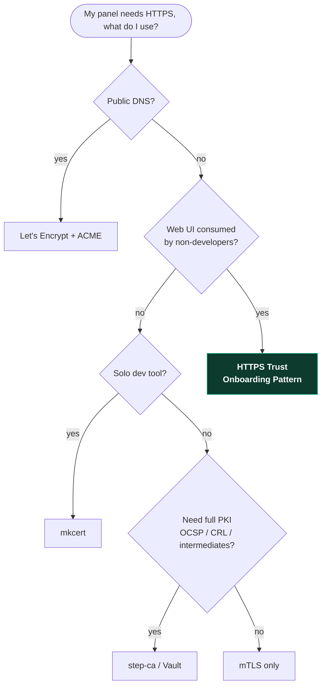
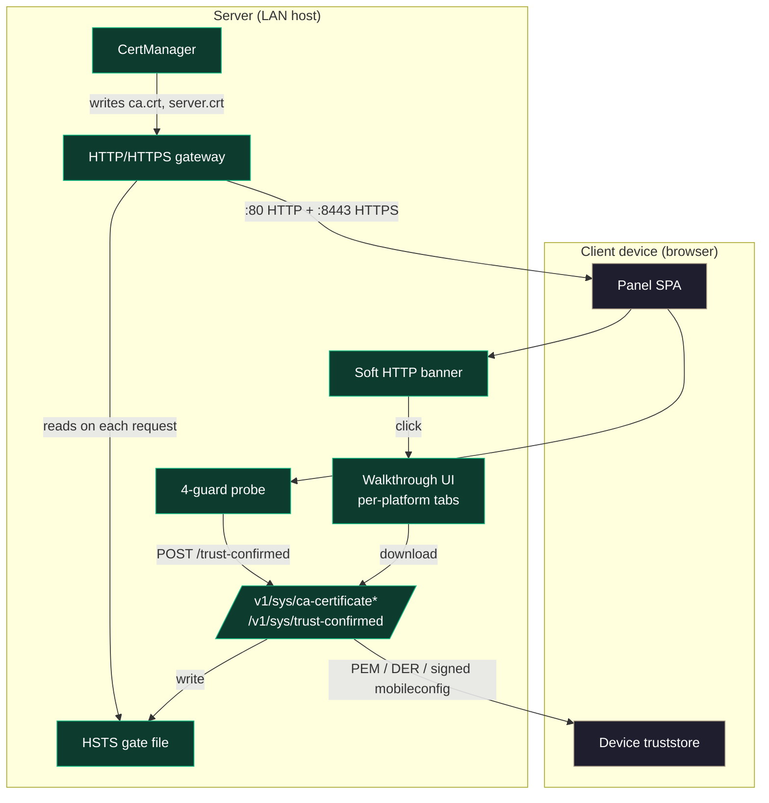
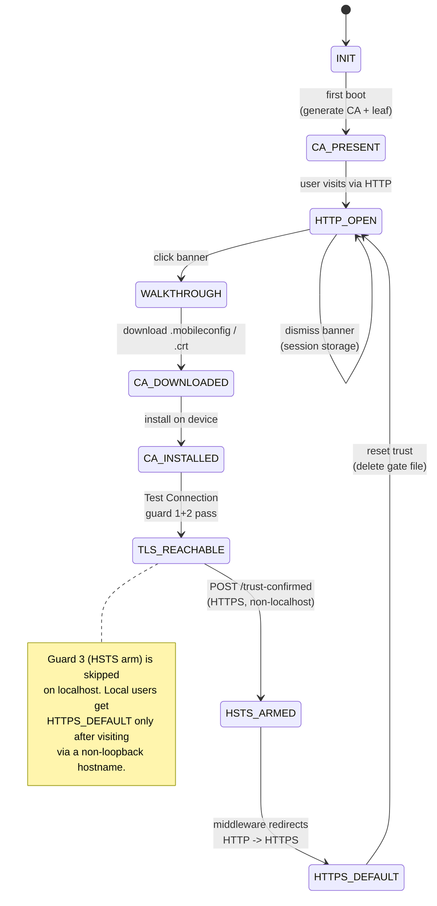
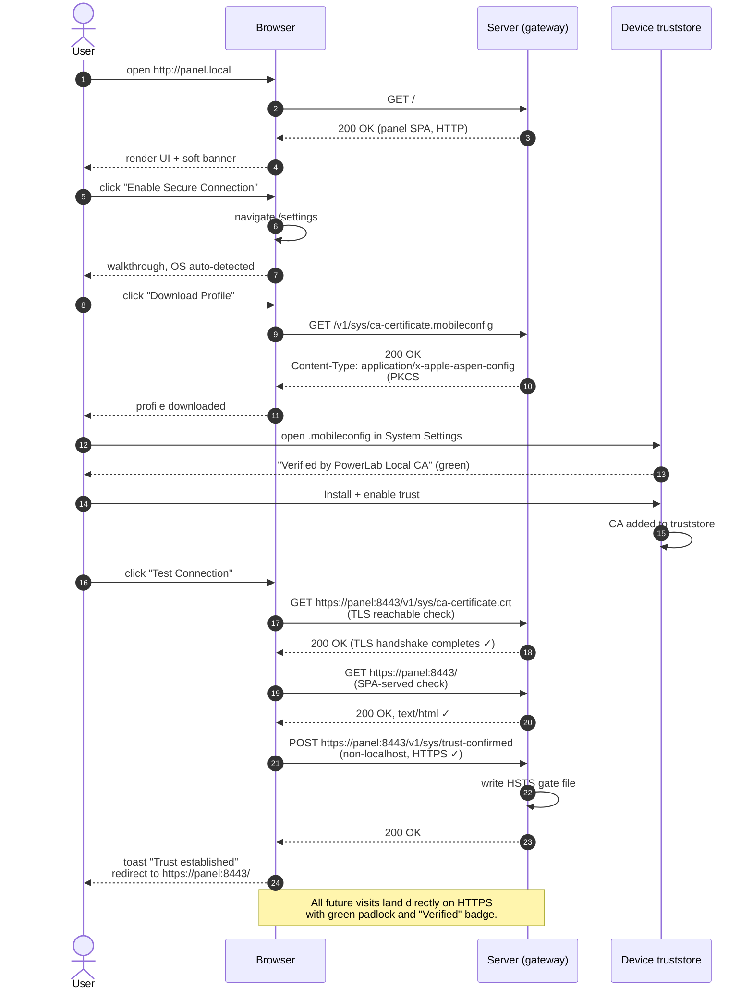
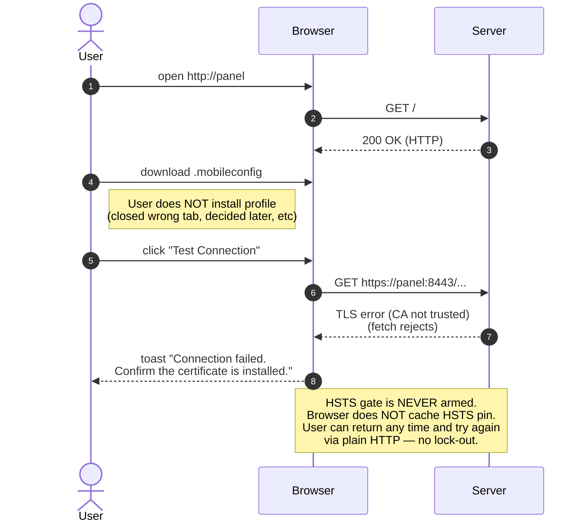
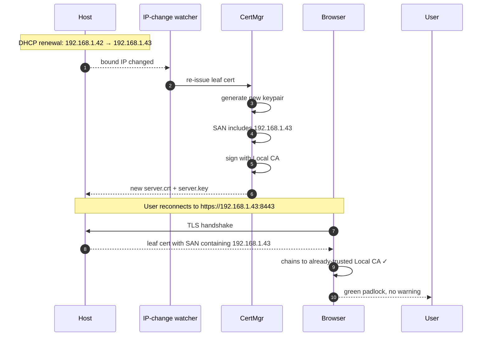
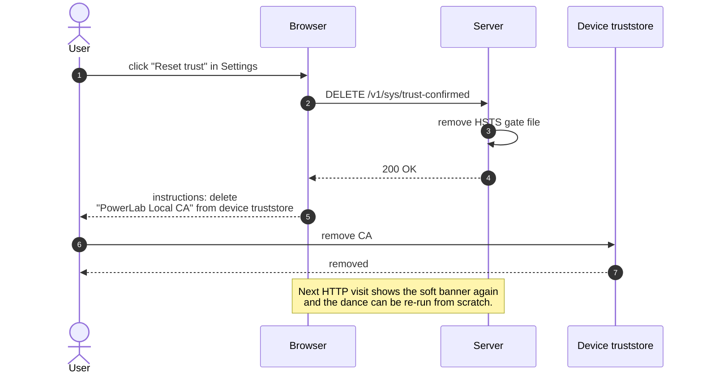
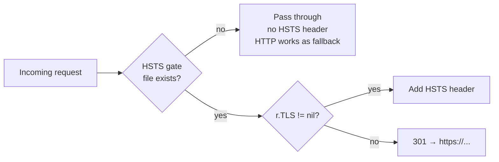
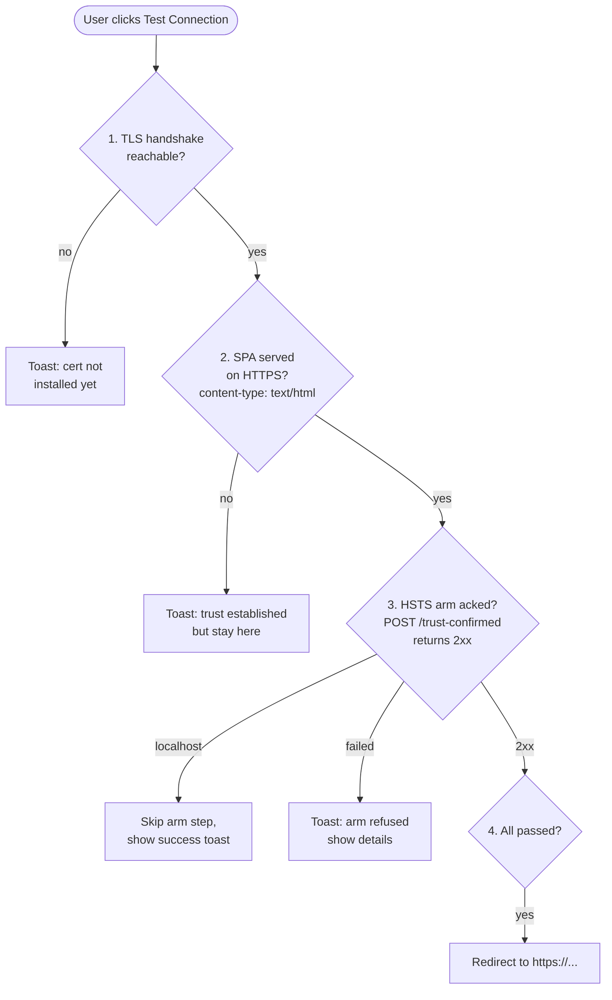

# HTTPS Trust Onboarding Pattern

> A reusable shape for getting a self-signed local CA trusted by
> client devices on a LAN, without sending the user to a single
> "Not Secure" warning page.

| Field | Value |
|---|---|
| **Status** | experimental, derived from the PowerLab v0.2.7 release |
| **Reference impl** | [neochaotic/powerlab](https://github.com/neochaotic/powerlab) |
| **License (pattern)** | public domain — copy, port, rename, own it |
| **License (reference impl)** | AGPL-3.0 |

---

## Table of contents

1. [Problem](#problem)
2. [Goals & non-goals](#goals--non-goals)
3. [When to use this pattern](#when-to-use-this-pattern)
4. [Glossary](#glossary)
5. [Architecture](#architecture)
6. [State machine](#state-machine)
7. [Sequence diagrams](#sequence-diagrams)
8. [Components in detail](#components-in-detail)
9. [Why these design choices — a UX-first walkthrough](#why-these-design-choices--a-ux-first-walkthrough)
10. [Endpoint contract](#endpoint-contract)
11. [Threat model](#threat-model)
12. [Security guarantees](#security-guarantees)
13. [Implementation guide (per language)](#implementation-guide-per-language)
14. [Testing checklist](#testing-checklist)
15. [Adoption notes](#adoption-notes)
16. [FAQ](#faq)
17. [Open extensions](#open-extensions)
18. [ADRs that codify this pattern](#adrs-that-codify-this-pattern)

---

## Problem

Self-hosted apps that run inside a home or office LAN cannot use
Let's Encrypt — they have no public domain to verify. Their
options today are:

1. **Plain HTTP** — ugly "Not Secure" badge in every browser, and
   the panel session ships secrets (passwords, tokens, file
   uploads) in cleartext over the LAN.
2. **Self-signed cert with no install path** — scary "Your
   connection is not private" red wall. Most users abandon, the
   ones who don't get desensitized to TLS warnings.
3. **External cloud tunnel** (Cloudflare Tunnel, Tailscale Funnel,
   ngrok) — solves it, but couples the deployment to a third
   party the user did not ask to depend on.

What's missing is the in-between: an internal-only product that
ships a private CA, gets it trusted by client devices via a clear
walkthrough, and reaches the green padlock without bleeding
secrets across the public internet.

The **HTTPS Trust Onboarding Pattern** is the choreography that
makes this work end-to-end: who generates what, who clicks what,
what the server holds back until trust is proven, and how the
user can recover if anything goes wrong.

## Goals & non-goals

### Goals

- **First user contact is HTTP, no warning page.** A soft banner
  explains what to do.
- **One-tap trust install on Apple devices** with the green
  "Verified" badge — no red "Unverified" warning.
- **Lock-out impossible.** HSTS does not arm until the user has
  proven trust works end-to-end.
- **Reset path that doesn't require shell access.**
- **Survives IP changes** — DHCP renewal, multi-NIC, mesh-VPN
  tunnels coming up post-boot.
- **Portable across stacks.** Pattern is HTTP + filesystem +
  browser; any web framework can implement.

### Non-goals

- Public-internet exposure. This pattern is for LAN / mesh-VPN
  reach. Public exposure needs a real CA and is a different problem.
- Replacing `mkcert`. mkcert is a developer tool for localhost-
  trusted certs on your own machine. This pattern is for
  end-user trust onboarding via a UI walkthrough.
- Full PKI. No CRL, no OCSP, no inter-CA chains. Single root,
  leaf per host, rotate on demand.

## When to use this pattern

This pattern is the right choice when **all** of the following hold:

| Condition | Why it matters |
|---|---|
| You ship a web UI that runs on a host the user controls (homelab box, edge appliance, on-prem panel) | The user has to install the CA on their devices — they need root on the host AND admin on the device they visit from. |
| The host has no public DNS / cannot run Let's Encrypt | Otherwise just use a real CA. |
| The audience includes non-developers | mkcert + a README link is not enough. The walkthrough + soft banner exist because users do not read docs. |
| The product is consumed via a browser (not just an API) | The 4-guard probe and the soft banner only make sense in a browser context. For API-only services, mTLS or token auth is a better fit. |
| Reaching the panel must work over LAN AND any mesh VPN the user already runs | The pattern's SAN-list rules anticipate Tailscale-style CGNAT addresses appearing post-boot. |

This pattern is the **wrong** choice when:

| Condition | Use instead |
|---|---|
| You need to expose the panel to the public internet | Real CA (Let's Encrypt, ZeroSSL) + ACME challenge. The pattern doesn't help here. |
| You only need certs for your own dev machine | [`mkcert`](https://github.com/FiloSottile/mkcert). Faster, no UI walkthrough, no HSTS gate. |
| You need a full internal PKI with revocation, OCSP, intermediate CAs | [`smallstep step-ca`](https://smallstep.com/docs/step-ca/) or HashiCorp Vault. |
| Your users are technical AND comfortable installing CA certs from a CLI | Skip the walkthrough; ship a `curl ... | sudo install` one-liner. |
| The threat model includes hostile peers on the same LAN with active MITM capability | A LAN-only CA doesn't help against an attacker already in your perimeter. Use mTLS or a hardware root of trust. |

### Decision tree



## Glossary

| Term | Meaning |
|---|---|
| **Local CA** | The self-generated root certificate authority. Signs leaf certs for the panel host. Stored at `<storage>/ca.{crt,key}` with `0600` perms on the key. |
| **Leaf cert** | The actual server cert presented over TLS. Signed by the Local CA. SAN includes localhost, mDNS hostname, RFC1918 IPs, IPv6 ULA. Rotated on IP change or near expiry. |
| **Trust Dance** | Informal name for the user-driven flow that gets the Local CA installed in the client device's truststore and verifies it works end-to-end. |
| **HSTS gate** | A flag file (`<storage>/.hsts-armed`) the server consults before emitting the `Strict-Transport-Security` header. Prevents lock-out. |
| **mobileconfig** | Apple's `.mobileconfig` file format — a plist that describes a Configuration Profile. PKCS#7-signed by the Local CA so iOS / macOS show "Verified" green. |
| **Soft banner** | The dismissible top-right pill that appears on HTTP visits. Direction-giving, not nagging. |
| **4-guard probe** | The client-side test that runs before redirecting to HTTPS. Catches every way the redirect target might fail to render. |
| **Reset trust** | The path that removes the HSTS gate file, prompts the user to delete the CA from their device, and restarts the dance. |

## Architecture



The **server side** owns:

- The Local CA generation + leaf signing.
- The HSTS gate file.
- The five `/v1/sys/*` endpoints that serve the CA and arm the gate.
- The middleware that reads the gate before emitting the HSTS
  header.

The **client side** (the panel SPA running in the user's browser)
owns:

- The soft HTTP banner.
- The walkthrough UI with per-OS tabs.
- The 4-guard probe that runs before the redirect-to-HTTPS.

The **device's OS / browser** owns the truststore. The pattern
never tries to bypass it.

## State machine



## Sequence diagrams

### Flow 1 — happy path, first-time user



### Flow 2 — failed install, no lock-out



### Flow 3 — IP change



### Flow 4 — reset trust



## Components in detail

### 1. CertManager

Generates the root CA on first boot, issues a leaf signed by it.
Re-issues the leaf when:

- The cert is within N days of expiry (default 60).
- The host's bound IP set changes.
- The user explicitly resets trust.

```
storage/
  ca.crt               PEM, world-readable
  ca.key               PEM, 0600 root-only
  server.crt           PEM, world-readable
  server.key           PEM, 0600 root-only
  .hsts-armed          empty marker file, owner-only
```

Algorithm: **ECDSA P-256**. CA validity 10 years; leaf 1 year.
Both bounded by browser policy (Chrome and Safari reject leaves
> 825 days). The 1-year leaf has a 60-day renewal margin so a
ticker outage is recoverable.

Reference: `backend/common/pkg/security/cert.go` (~330 LOC).

### 2. PKCS#7 mobileconfig signer

Wraps an Apple Configuration Profile (`.mobileconfig`, plist XML)
in a PKCS#7 SignedData blob using the **CA's own private key**.

Apple parses the outer PKCS#7 envelope to validate the signer
chain. Once the user has installed the CA, iOS / macOS render the
profile as **"Verified by &lt;CA Name&gt;"** in green. Without
this signing, Apple shows **"Unverified"** in red and most users
abandon the flow.

The signer cert is the same CA the user is about to install — a
small chicken-and-egg situation. iOS resolves it by deferring the
"Verified" badge until the CA is in the truststore. Until then,
"Verified" is grey-yellow ("Verified" but the chain isn't fully
trusted yet); only after install does it go green.

Reference: `signPKCS7()` in
`backend/gateway/route/security_route.go`.

### 3. HSTS gate file

A flag file the server consults before emitting the
`Strict-Transport-Security` header. The flag is created **only**
by an authenticated `POST /trust-confirmed` over HTTPS from a
non-localhost peer. Until then, HSTS stays off.

This is the **load-bearing guarantee** of the pattern: even if a
user fumbles the trust install, they can always reach the panel
over plain HTTP and restart the walkthrough. No browser ever
caches an HSTS pin against a CA the user never installed.



### 4. WrapHSTS middleware

Single HTTP middleware around the gateway's request handler.
Pseudo-code:

```go
func WrapHSTS(next Handler, httpsPort string) Handler {
  return Handler(func(w, r) {
    armed := isHSTSArmed()
    if r.TLS != nil {
      if armed { w.Header().Set("Strict-Transport-Security", "max-age=31536000; includeSubDomains") }
      next.ServeHTTP(w, r)
      return
    }
    // Plain HTTP. Redirect only when armed; otherwise serve as
    // normal so the user can finish the trust dance.
    if !armed {
      next.ServeHTTP(w, r)
      return
    }
    redirectToHTTPS(w, r, httpsPort)
  })
}
```

Reference: `WrapHSTS()` in
`backend/gateway/route/gateway_route.go`.

### 5. Soft banner

A discreet pill in the top-right corner that appears when
`window.location.protocol === 'http:'`. Click → walkthrough;
dismiss-X persists for the session (`sessionStorage`).

Loud full-width banners get ignored. Soft pills get clicked.

Reference:
`ui/src/lib/components/security/HttpBanner.svelte`.

### 6. Walkthrough UI

Per-platform install instructions, auto-detected from
`navigator.userAgent`. Tabs: **iOS, macOS, Android, Windows**.
Each tab shows the steps + the right download button.

Platform detection is intentionally conservative: when ambiguous
(Linux, unknown UA), default to the manual-install variant
(`.crt` + `update-ca-certificates`). The wrong default is more
recoverable than no default.

Reference: `ui/src/routes/settings/+page.svelte` (Security tab).

### 7. Test Connection — 4-guard probe

The completion gate. Before redirecting the user to HTTPS, verify
that the redirect target will actually render. **Four checks:**



Failure modes degrade to a success toast instead of a forced
navigation that may strand the user. **The white-screen-of-death
class of bug is closed.**

Reference: `testHttpsConnection()` in
`ui/src/routes/settings/+page.svelte`.

### 8. Reset-trust path

A button in Settings that:

- Removes the HSTS gate file (server-side, via authenticated DELETE).
- Tells the user to delete the CA from their device's truststore
  (each OS gets its own concrete instructions).
- Re-shows the soft banner on the next HTTP visit.

Without this, a user who installed the CA on a borrowed device,
or who wants to rotate the CA, has to drop to a shell.

Reference: ADR 0003.

## Why these design choices — a UX-first walkthrough

Every load-bearing decision in this pattern was made because a
simpler alternative produced a measurably worse user experience.
This section walks each one back to the failure mode it prevents,
so a future maintainer can challenge it from first principles.

### Why a soft banner instead of a full-width amber bar

**Tried first**: a `position: fixed; top: 0; left: 0; right: 0`
amber banner that took 60 px of vertical real estate on every
HTTP visit and shouted "Connection unencrypted, enable HTTPS".

**Failure mode**: users who deliberately stayed on HTTP for
testing — homelab dev work, exploring behind a reverse proxy,
poking around — were nagged on every page load. Banner blindness
set in within minutes. The "Enable Secure Connection" CTA had a
worse click-through rate than a plain text link in the footer.

**Pattern's answer**: a discreet pill in the top-right corner.
Same color, same icon, same destination — but smaller, dismissible
per session, easy to ignore for users who already know what HTTP
means and can't be bothered today.

**Lesson**: information density of warnings should match how often
the user can actually act on them. HTTPS install is a one-time
task; the banner shouldn't behave like an alarm.

### Why a 4-guard probe and not a single "ping HTTPS" check

**Tried first**: `fetch('/v1/sys/ca-certificate.crt', { mode: 'no-cors' })`,
on success → redirect.

**Failure mode**: on a dev machine where the gateway serves APIs
on `:8443` but not the SPA (Vite hands the SPA on `:5173`), the
fetch succeeded (TLS works for the API) → redirect fired →
browser landed on the gateway's JSON 404 → user saw
`{"message":"Not Found"}` and thought the panel had died.

The user's actual reaction was: *"muito critico isso na
experiencia.. certa que isso nao aconteca nunca"*.

**Pattern's answer**: 4 guards. The TLS probe answers "can my
browser handshake with this server" but not "will the URL I'm
about to navigate to render". So we add Guard 2 (HTTPS root
returns `text/html`), Guard 3 (HSTS arming actually wrote the
gate file), Guard 4 (only redirect when 1-3 all pass).

**Lesson**: never redirect the user to a URL without first
verifying the URL will produce something they can interact with.
Every "redirect-on-success" flow eventually meets a state where
the success was reported but the destination is broken; the
4-guard probe is the generalization of that lesson.

### Why HSTS is gated behind the user, not turned on at boot

**Tried first**: emit `Strict-Transport-Security` immediately,
let the browser cache the pin.

**Failure mode**: the user follows half the install flow,
walks away, comes back next week, can't remember which device
the CA went onto. Every browser they've ever used to visit the
panel now refuses to load HTTP and refuses to load HTTPS without
the CA. The user is locked out without shell access.

**Pattern's answer**: the HSTS gate file. HSTS only arms after a
real, verified, non-loopback HTTPS request has succeeded. If
anything in the dance fails — the cert install, the truststore
config, the network — the gate stays empty and HTTP keeps working
as the recovery path.

**Lesson**: pinning a security claim with a long TTL (HSTS, HPKP,
etc.) is one-way; the moment you pin against an unproven
foundation, you've handed the user a self-inflicted lock-out.
Always require proof-of-work before you pin.

### Why PKCS#7 sign the mobileconfig instead of just shipping the plist

**Tried first**: serve the unsigned plist.

**Failure mode**: iOS shows the profile as **"Unverified"** in
red. End users abandon the install at that screen. Bug reports
trickle in: "I can't trust the panel, the install is broken,
help."

**Pattern's answer**: sign the plist with PKCS#7 using the CA's
own private key. iOS resolves the chain to the same CA the user
is about to trust and renders **"Verified"** in green.

The chicken-and-egg here is real: the signer cert IS the CA the
user is about to install. iOS handles this gracefully — until
the CA is in the truststore, "Verified" appears in muted
yellow-grey ("trusted by the document, not by the system");
after install, it goes green. Users don't notice the transition;
they notice the absence of red.

**Lesson**: a 5-minute coding effort (PKCS#7 SignedData) buys a
massive UX win on Apple. Skipping the signing because "the
install still works without it" misses the actual cost — most
users *don't* install when iOS warns them.

### Why per-OS tabs and not a wizard

**Tried first**: a multi-step wizard. Step 1: detect OS. Step 2:
download. Step 3: install. Step 4: confirm.

**Failure mode**: a wizard implies a linear path. Users who got
halfway through and got distracted couldn't restart from the
right step. Users who already had the cert and just wanted to
re-test connection had to walk through the wizard again. The
back/forward buttons broke state.

**Pattern's answer**: 4 OS tabs side by side, all visible at
once. Default to the OS we detect from `navigator.userAgent`,
let the user switch freely. The "Test Connection" button is
always visible. The download button is always at hand.

**Lesson**: trust onboarding is not a one-shot funnel; it's a
reference page the user might revisit. Treat it like
documentation, not like a checkout flow.

### Why dual-listen on HTTP and HTTPS, not HTTPS-only

**Tried first**: serve only HTTPS. Anyone hitting HTTP gets 301'd.

**Failure mode**: chicken-and-egg. The user can't reach the panel
until they've installed the CA. They can't install the CA until
they've reached the panel. The 301 redirects them to a URL their
browser refuses to load.

**Pattern's answer**: the gateway listens on **both** HTTP and
HTTPS simultaneously, and the redirect only fires when the HSTS
gate is armed (i.e., trust dance has completed). HTTP stays as
the entry door until the user is through it.

**Lesson**: don't enforce TLS at the cost of making the
onboarding flow unreachable. The cost of "first contact is HTTP"
is small (one one-time download); the cost of "first contact is
unreachable" is total.

### Why is the verification button on the same page as the walkthrough

**Tried first**: separate "Verify" page.

**Failure mode**: users finished the install, lost track of where
they were, never clicked the verify button → never armed HSTS →
HTTP→HTTPS redirect never started working → next visit they
came back to the dance from scratch.

**Pattern's answer**: the verify button sits at the bottom of
the same panel where the walkthrough lives. The user finishes the
install, scrolls down two inches, clicks. Single page, single
session.

**Lesson**: every "and then go to..." step is a place users drop
off. Compress the dance into one screen.

### Why surface the GitHub source link in the docs

**Tried first**: pure abstract pattern doc, no concrete reference.

**Failure mode**: implementers asked "is this a real pattern or
a thought experiment?" The doc looked like a manifesto.

**Pattern's answer**: link the reference implementation file paths
under each component. The reader can `git clone` and trace the
exact LOC. Not a manifesto — running code.

**Lesson**: a pattern without a working reference is unfalsifiable.
Pin the abstraction to running code so claims like "this works
on iOS Safari 17" can be verified, not just asserted.

## Endpoint contract

The reference implementation exposes:

| Method | Path | Purpose |
|---|---|---|
| GET | `/v1/sys/ca-certificate` | UA-aware redirect to one of the formats below |
| GET | `/v1/sys/ca-certificate.crt` | PEM-encoded CA cert (Linux, Android, fallback) |
| GET | `/v1/sys/ca-certificate.cer` | DER-encoded CA cert (Windows Certificate Import Wizard) |
| GET | `/v1/sys/ca-certificate.mobileconfig` | PKCS#7-signed Apple Configuration Profile |
| POST | `/v1/sys/trust-confirmed` | arms the HSTS gate (only from HTTPS, non-localhost) |
| DELETE | `/v1/sys/trust-confirmed` | removes the gate (reset trust) |

The server-side check on `POST /trust-confirmed`:

```
if r.TLS == nil:                  400, "must be HTTPS"
if remoteAddr is loopback:        400, "must be non-localhost"
if r.Method == DELETE:            require admin auth, then unlink gate file
write HSTS gate file:             200
```

## Threat model

The pattern is designed against a specific threat model. Anything
outside the model is out of scope.

### In scope (assumptions about the environment)

- **The LAN is a trust boundary.** Anyone on the LAN can talk to
  the panel. The pattern doesn't try to defend against a hostile
  device on the same Wi-Fi.
- **The user has admin access to the box** (root/sudo). Reset
  trust requires this.
- **The browser is reasonably modern.** ES2020+, fetch with
  AbortSignal.timeout, sessionStorage.
- **The CA private key file is protected by the OS** (`0600`,
  root-only).

### Out of scope

- **Public-internet exposure.** A different problem; needs
  Let's Encrypt / mutual TLS / reverse-proxy fronting.
- **Rogue CA install.** A user who installs a malicious CA from
  a phishing email can be MITM'd on any site, not just the panel.
  The pattern can't fix this.
- **Compromised host.** If an attacker has root on the panel host,
  they can mint any cert they want against the local CA. That's
  by design — the CA is for the host's own use.

### Adversaries

| Adversary | Capability | Mitigation |
|---|---|---|
| Hostile LAN peer | Sniff TLS handshakes | TLS encrypts payload; cert is public info anyway |
| Hostile LAN peer | Try to arm HSTS for someone else | `/trust-confirmed` requires HTTPS + non-localhost — a peer can post to it, but it only arms the host's own gate, no remote effect on victim browser |
| User who fumbles trust dance | Browser caches an HSTS pin against an untrusted CA | **HSTS gate is the explicit defense.** No HSTS header until trust dance succeeds. |
| Attacker with cert.key file | Mint trusted leaves | OS-level file perms (`0600`); rotate CA via reset-trust |
| Curious end user | Re-create the dance to mess with HSTS | The reset-trust path is intentionally accessible. Worst case they re-do the dance. |

## Security guarantees

- **HSTS lockout impossible.** Gate file is on the server's own
  filesystem; deleting it is one shell command and resets the flow.
- **CA private key locked down.** `0600`, root-only. Never served
  by any handler.
- **Leaf rotated on IP change.** A leaf signed for `192.168.1.42`
  is useless once the box's IP changes; the pattern re-issues
  automatically.
- **PKCS#7 signing optional, not load-bearing.** If the signer
  fails (missing key, wrong perms), the server falls back to
  serving the unsigned plist. Apple shows "Unverified" but the
  install still works. Better than 500.
- **Test Connection short-circuits in dev.** Any future "redirect
  to a URL that doesn't render" bug is caught by the 4-guard
  probe; the white-screen-of-death class of failure is closed.
- **Trust-confirmed cannot be armed remotely.** The non-localhost
  check is in the handler; CSRF / cross-origin POSTs from a
  hostile site fail the rule.

## Implementation guide (per language)

The pattern is HTTP + filesystem + browser; portable to any web
framework. The components below are the load-bearing pieces;
everything else is plumbing.

### Go

```
crypto/ecdsa, crypto/x509            stdlib — CA + leaf generation
github.com/digitorus/pkcs7           PKCS#7 mobileconfig signer
net/http middleware                  HSTS gate logic
//go:embed                           bundle the .mobileconfig template
```

Reference impl is ~600 LOC across `cert.go` + `security_route.go`
+ `gateway_route.go`.

### Node.js / TypeScript

```
node-forge or @peculiar/x509         CA + leaf generation
node-forge PKCS#7 module             mobileconfig signer
Express / Fastify middleware         HSTS gate logic
fs.readFileSync                      embedded plist template
```

Roughly equivalent LOC; node-forge is heavier as a dep tree.

### Python

```
cryptography                         CA + leaf generation
asn1crypto + pyhanko-certvalidator   PKCS#7 signer
Flask before_request / FastAPI Depends   HSTS gate logic
importlib.resources                  bundled template
```

Slightly more verbose; pyhanko has a steeper learning curve than
digitorus/pkcs7.

### Rust

```
rcgen                                CA + leaf generation
cms (RustCrypto/cms)                 PKCS#7 SignedData
tower / actix middleware             HSTS gate logic
include_str!                         embedded template
```

The Rust ecosystem is younger here; double-check that the chosen
PKCS#7 lib produces SignedData that Apple actually accepts.

## Testing checklist

A reference implementation should pass at minimum:

- **Unit**: SAN classification (RFC1918, IPv6 ULA, mesh-VPN
  CGNAT). Pin the rules.
- **Unit**: PKCS#7 verification — the produced blob parses, the
  signer cert is embedded, the inner content recovers byte-for-byte.
- **Unit**: trust-confirmed handler rejects HTTP, rejects loopback.
- **Unit**: WrapHSTS middleware — 4 cases (HTTPS+armed,
  HTTPS+not-armed, HTTP+armed, HTTP+not-armed).
- **Integration / E2E**: full happy path, full failed-install
  path, reset-trust path.
- **Manual gate**: real iPhone install, confirm "Verified" badge
  is **green** (not red).
- **Manual gate**: HSTS arm survives reboot.
- **Manual gate**: reset trust + re-install works.

## Adoption notes

For a new project adopting the pattern:

1. **Start with the storage layout.** Create the `<storage>/`
   directory with `0700` perms. The pattern depends on file-perm
   isolation.
2. **Implement CertManager next.** Generate CA on first boot,
   sign a leaf, persist both. Add the daily ticker last; without
   it the cert still works for a year.
3. **Wire the endpoints.** All five `/v1/sys/*` routes on the
   gateway. Don't put them behind auth — users need them BEFORE
   they have HTTPS.
4. **Add WrapHSTS middleware.** Around every route, including the
   `/v1/sys/*` ones.
5. **Add the soft banner.** One file. Don't cargo-cult the dismiss
   storage — `sessionStorage` is the right scope (per session,
   not forever).
6. **Add the walkthrough.** Per-OS tabs. Auto-detect, conservative
   default.
7. **Add the 4-guard probe.** Don't skip a guard — every one of
   them prevents a real failure mode that has been observed in
   the wild.
8. **Add reset-trust.** Last; you'll only need it once you have
   real users.

## FAQ

### Why not just use a public CA?

Because the panel doesn't have a public domain. To get a Let's
Encrypt cert you need to prove control of a domain via DNS-01 or
HTTP-01, and homelab boxes typically have neither.

Some products solve this by registering a public domain that
points at private IPs (sslip.io, traefik.me). That works but adds
an external dependency the user didn't ask for. This pattern is
the no-external-deps alternative.

### Why ECDSA P-256 and not RSA?

ECDSA P-256 produces smaller certs and faster handshakes,
universally supported across modern OS truststores. The original
mkcert defaulted to ECDSA after years of trying RSA-2048. We
inherited the convention.

### Why a 1-year leaf, not 90 days like Let's Encrypt?

Browser policy caps leaves at 825 days. 1 year leaves room for
the daily renewal ticker to recover from a 1-month outage without
HTTPS breaking. 90 days is right for cloud where renewal is
easy; 1 year is right for a homelab box that may be unattended
for months.

### Won't HSTS lock me out if I lose the CA?

No. The pattern's whole point is **HSTS is gated**. The browser
only caches an HSTS pin once `POST /trust-confirmed` succeeds.
If you lose the CA before completing the dance, the gate file is
never written, no HSTS pin is ever set, and you can keep visiting
via plain HTTP forever.

If you lose the CA *after* completing the dance, the reset-trust
path removes the gate file, and you can regenerate the CA and
restart the dance. The browser's HSTS cache is per-host, capped
at 1 year — and you control the host, so you can clear it via
reset-trust + DNS migration if you ever need to.

### Why expose the CA download endpoints unauthenticated?

Catch-22: the user needs the CA *before* they can authenticate
over HTTPS. If we required auth, every user would need to log
in over HTTP, get a token, then download the CA over HTTP — and
that auth-over-HTTP step is exactly what the pattern is trying
to avoid.

The CA cert is public information by definition (it's what
clients verify against; it's literally meant to be shared). The
risk vector is "someone on the LAN downloads our public CA cert"
— which is fine, that's what it's for.

### Doesn't this just push the problem to "trust the CA"?

Yes. The user has to trust the CA install, which is a one-time
step. The pattern's value is making that step:

1. **Visible** (banner, walkthrough — not buried in docs).
2. **Resilient** (HSTS gate prevents lock-out if the user
   fumbles).
3. **Reversible** (reset-trust path).
4. **Polished** (PKCS#7 signing for "Verified" green badge).

The trust step itself is unavoidable in any LAN-only TLS story.

### What about Smallstep / step-ca?

step-ca is a full PKI server with ACME support. Heavier, suited
for environments where many internal services need their own
certs. This pattern is the lightweight version: one host, one
panel, one walkthrough.

### What about Caddy's automatic HTTPS with internal CA?

Caddy's `internal` directive does generate a CA and signs leaves
for internal addresses. The gap is the **client-side install
flow** — Caddy hands you a CA cert and says "go install this".
This pattern is the missing UI layer.

A Caddy-based implementation is a great fit; the WrapHSTS
middleware drops in.

## Open extensions

| Feature | Status | Notes |
|---|---|---|
| Mesh-VPN MagicDNS hostname in SAN | tracked | Requires querying the mesh client's local API; currently we only include CGNAT IPs when a mesh-shaped iface is up. |
| Multi-host CA sync | open | A second box could ride the first's CA via a "trust me too" delegation protocol. Not designed yet. |
| Cross-signing for CA rotation | open | Sign the new CA with the old CA so devices pick up the new one without user action. Single-sentence concept; gnarly to implement correctly. |
| ACME server emulation | open | Let other internal services use the panel as their issuer. step-ca already does this; not sure it belongs in the pattern. |

## ADRs that codify this pattern

In the PowerLab repo, [`docs/decisions/`](../decisions/):

- **0001** — cert validity (1y leaf, 10y CA)
- **0002** — `digitorus/pkcs7` library choice
- **0003** — reset-trust UX (single confirm + device list)
- **0004** — walkthrough UX (inline 4 tabs, not wizard)
- **0006** — HSTS gated on first verified non-localhost client
- **0007** — internal-network-only initial deployment scope
- **0009** — name + canonical reference (this document)

## License & contributions

The pattern itself is in the public domain — copy, port, rename,
own it. The reference implementation in PowerLab is AGPL-3.0;
[issue #53] tracks extracting the Go middleware as a separate
MIT-licensed module so it's reusable in commercial products.
